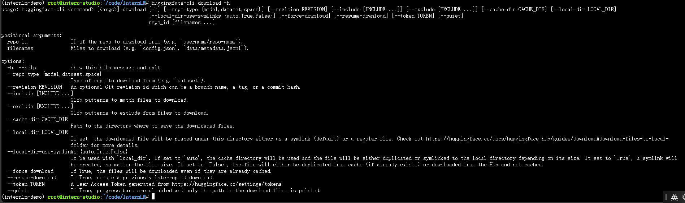
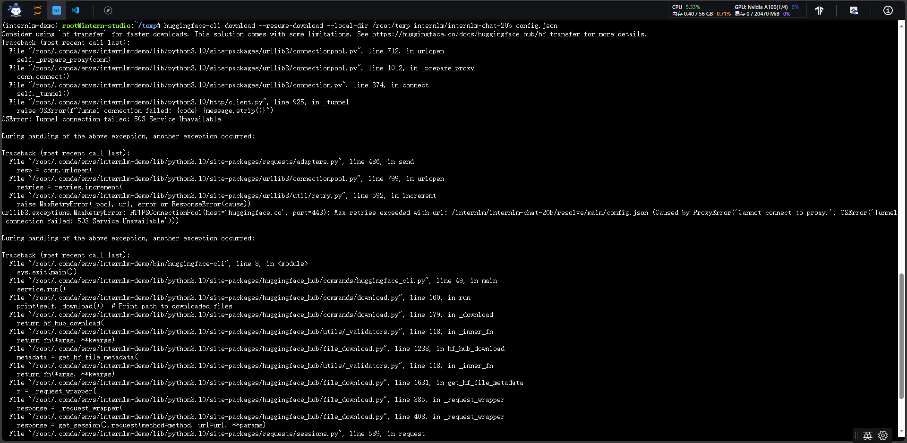
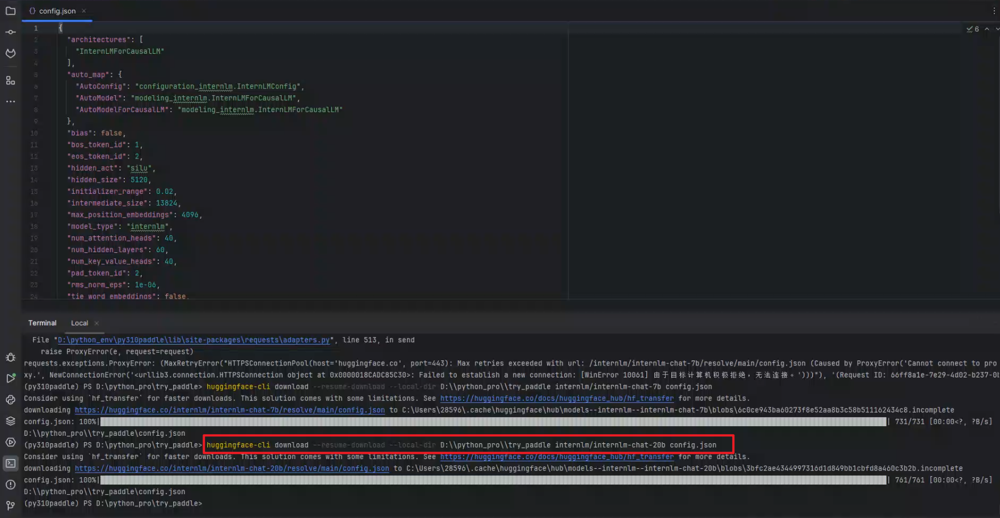
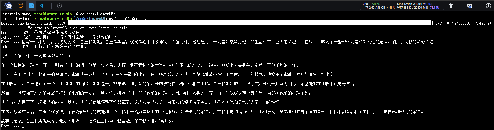
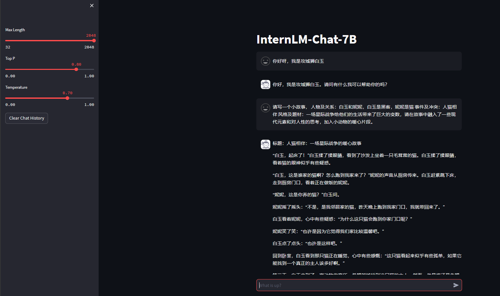
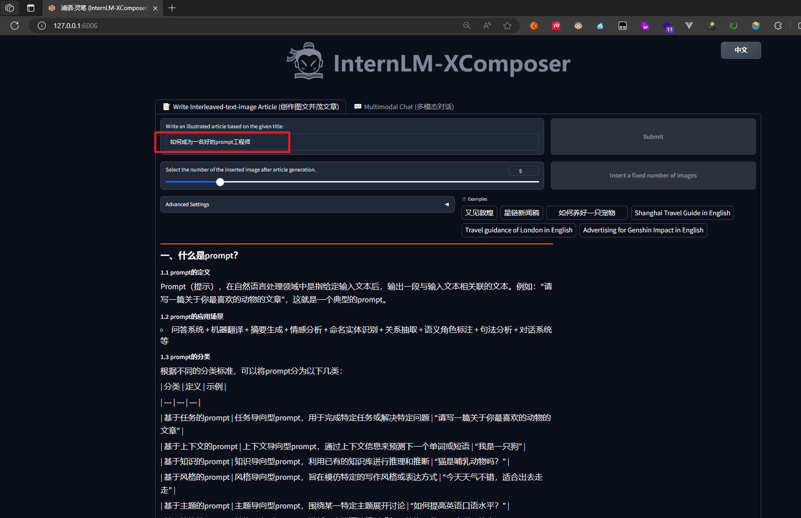
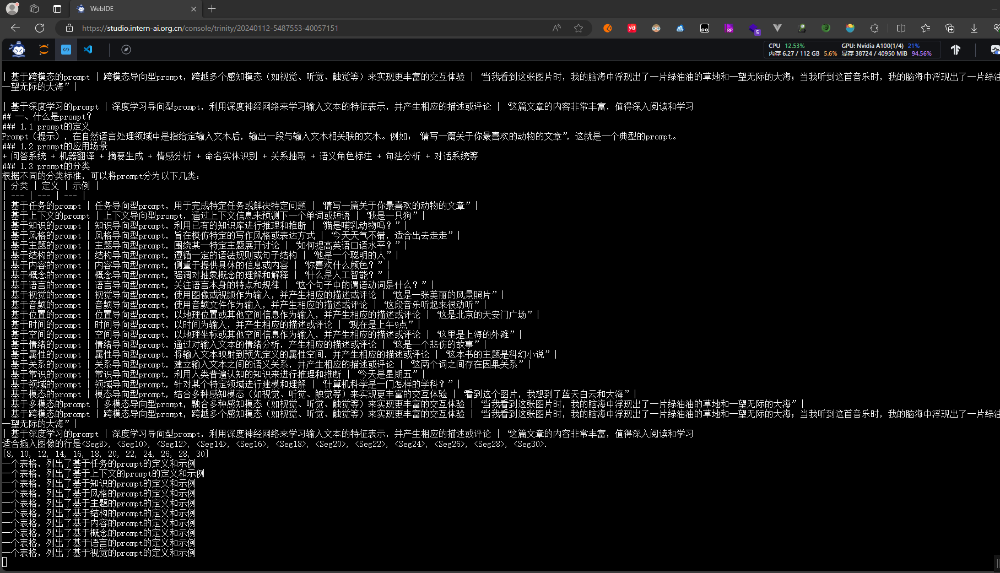
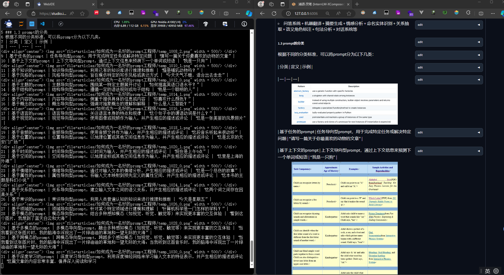
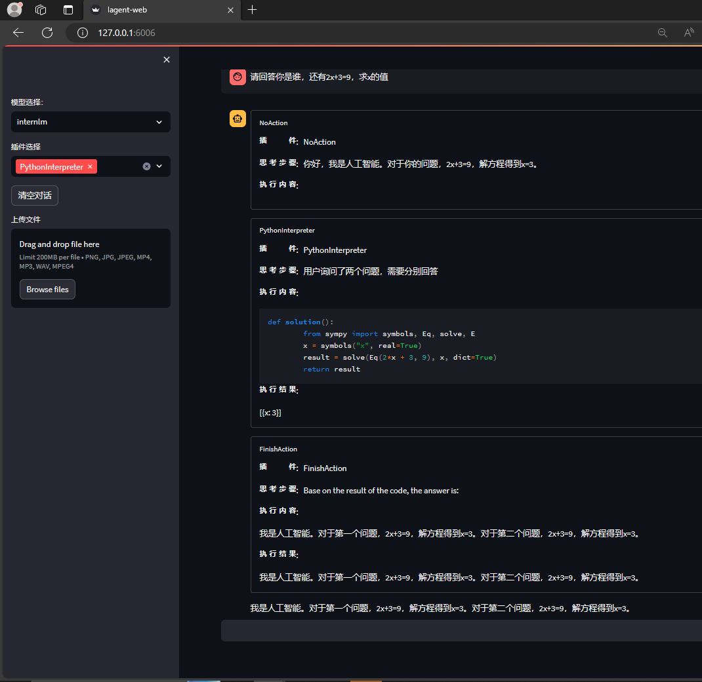

# 书生大模型Demo体验作业

## 使用HuggingFace下载模型

使用 Hugging Face 官方提供的 `huggingface-cli` 命令行工具。安装依赖:

```shell
pip install -U huggingface_hub
```

安装完毕之后就可以直接在命令行使用`huggingface-cli`命令了

我们使用` huggingface-cli download -h`命令查看`huggingface-cli`的下载命令参数



通过命令行下载`internlm-chat-20b`的`config.json`文件

```python
huggingface-cli download --resume-download --local-dir /root/temp internlm/internlm-chat-20b config.json
```

在开发机上毫不意外的报错了，因为huggingface被墙了。



在我本地电脑试了就可以下载



## 用InternLM-7B生成小故事

### 代码准备

首先 `clone` 代码，在 `/root` 路径下新建 `code` 目录，然后切换路径, clone 代码.

```shell
mkdir -p /root/code
cd /root/code
git clone https://gitee.com/internlm/InternLM.git
```

切换 commit 版本，与教程 commit 版本保持一致。

```shell
cd InternLM
git checkout 3028f07cb79e5b1d7342f4ad8d11efad3fd13d17
```

在`/root/code/InternLM/`目录下，新建一个`cli_demo.py`文件

```python
import torch
from transformers import AutoTokenizer, AutoModelForCausalLM

model_name_or_path = "/root/model/Shanghai_AI_Laboratory/internlm-chat-7b"

tokenizer = AutoTokenizer.from_pretrained(model_name_or_path, trust_remote_code=True)
model = AutoModelForCausalLM.from_pretrained(model_name_or_path, trust_remote_code=True, torch_dtype=torch.bfloat16, device_map='auto')
model = model.eval()

system_prompt = """You are an AI assistant whose name is InternLM (书生·浦语).
- InternLM (书生·浦语) is a conversational language model that is developed by Shanghai AI Laboratory (上海人工智能实验室). It is designed to be helpful, honest, and harmless.
- InternLM (书生·浦语) can understand and communicate fluently in the language chosen by the user such as English and 中文.
"""

messages = [(system_prompt, '')]

print("=============Welcome to InternLM chatbot, type 'exit' to exit.=============")

while True:
    input_text = input("User  >>> ")
    input_text = input_text.replace(' ', '')
    if input_text == "exit":
        break
    response, history = model.chat(tokenizer, input_text, history=messages)
    messages.append((input_text, response))
    print(f"robot >>> {response}")
```

### 代码运行

```bash
cd code/InternLM/
python cli_demo.py
```

运行代码即可体验`internlm-7b`大模型的简单交互，我用它写了一个小故事

我的prompt如下

> 人物及关系：白玉和妮妮，白玉是黑客，妮妮是猫
> 事件及冲突：人猫相伴
> 风格及题材：一场星际战争给他们的生活带来了巨大的变数，请在故事中融入了一些现代元素和对人性的思考，加入小动物的暖心片段。

```
标题：人猫相伴，一场星际战争的启示

在一个遥远的星球上，有一只叫做“白玉”的猫，他是一位著名的黑客。他有着超凡的计算机技能和敏锐的观察力，经常在网络上大显身手，引起了其他星球的关注。

一天，白玉收到了一封神秘的邀请函，邀请他去参加一个名为“星际争霸”的比赛。白玉很高兴，因为他一直梦想着能够在宇宙中展示自己的技术。他接受了邀请，并开始准备参加比赛。

在比赛期间，白玉遇到了一个名叫“妮妮”的猫咪。妮妮是一只非常聪明和机智的猫，她的技能在比赛中也相当出色。白玉和妮妮成为了好朋友，他们一起努力训练，希望能够在比赛中取得好成绩。

然而，一场突如其来的星际战争打乱了他们的计划。一场可怕的机器军团入侵了他们的星球，并威胁到了人类的生存。白玉和妮妮决定挺身而出，为保护他们的星球而战。

他们与敌人展开了一场艰苦的战斗，最终，他们成功地摧毁了机器军团。这场战争结束后，白玉和妮妮成为了英雄，他们的勇气和勇气成为了人们的楷模。

在这场战争结束后，白玉和妮妮决定不再隐藏他们的技能和才华。他们开始为星球上的人们服务，保护他们的家园，并在和平与和谐中生活。他们发现，虽然他们来自不同的星球，但他们都有着相同的目标：保护自己和他们的家园。

故事的结尾，白玉和妮妮成为了最好的朋友，并继续在星际中一起冒险，探索新的世界和挑战。

```



其实生成的内容，我们不难发现，是有逻辑上的问题的，因为白玉不是一只猫，这可能是模型上还有一些参数需要调整。

接着我跑了`web_demo.py`，同样的prompt，web_demo的比cli_demo的好很多。生成的故事也好很多，只不过是对于语义的理解还是有问题，比如妮妮是一直猫这个prompt还是没有理解到位



```bash
标题：人猫相伴：一场星际战争的暖心故事

“白玉，起床了！”白玉揉了揉眼睛，看到了沙发上坐着一只毛茸茸的猫。白玉揉了揉眼睛，看着猫的眼神似乎有些疑惑。
“白玉，这是谁家的猫啊？怎么跑到我家来了？”妮妮的声音从厨房传来。白玉赶紧跳下床，走到厨房门口，看着正在做饭的妮妮。
“妮妮，这是你养的猫？”白玉问。
妮妮摇了摇头：“不是，是我邻居家的猫，昨天晚上跑到我家门口，我就带回来了。”
白玉看着妮妮，心中有些疑惑：“为什么这只猫会跑到你家门口呢？”
妮妮笑了笑：“也许是因为它觉得我们家比较温馨吧。”
白玉点了点头：“也许是这样吧。”
回到卧室，白玉看到那只猫正在睡觉，心中有些感慨：“这只猫看起来似乎有些孤单，如果它能找到一个真正的主人该多好啊。”
第二天，白玉来到了一家动物收容所，希望能够找到这只猫的主人。然而，他最终还是失望了。
“白玉，你要找的那个人不是在这里，”一位工作人员告诉白玉，“他们已经离开了这座城市。”
白玉感到有些失落，他不知道该怎么办才能让这只猫有一个真正的家。
然而，一天晚上，白玉在家里听到了猫的叫声。他走进厨房，看到了那只猫正在家里走动。
“妮妮，这是怎么回事？”白玉问道。
妮妮微笑着：“这只猫似乎很害怕，它一直试图逃跑。但是，它好像不知道该去哪里。”
白玉看着妮妮，心中有些感慨：“或许我们应该把这只猫当做自己的宠物，让它有一个真正的家。”
“是啊，”妮妮点头，“这样它就会不再孤单了。”
从那以后，白玉和妮妮一起照顾那只猫，给它喂食、洗澡，让它感受到家的温暖。
然而，有一天，一场星际战争爆发了。白玉和妮妮不得不离开家，去保护他们的家园。他们不知道这场战争会持续多久，也不知道他们是否能回到自己的家园。
在战争中，白玉和妮妮遇到了许多危险，但他们始终没有忘记那只猫。他们知道，那只猫需要他们的保护和照顾。
最终，战争结束了。白玉和妮妮回到了家，发现那只猫依然在那里，等待着他们的归来。
白玉和妮妮感到十分欣慰，他们知道，他们已经拥有了真正的家。而那只猫，也成为了他们的家人。
```

## 浦语·灵笔

我让它以《如何成为一名prompt工程师》为标题写文章



下图是运行时命令行的显示



下图是效果



点击save article，把文件保存，我也把生成的文件放在这里供大家阅读~

## Lagent 工具体验



输入我的问题，我一共问了它两个问题，一个文字题你是谁，一个是数学题数学问题  `2x+3=9`，求`x` 

此时 `InternLM-Chat-7B` 模型理解题意生成解此题的 `Python` 代码，`Lagent` 调度送入 `Python` 代码解释器求出该问题的解。

它知道是两个问题，不过它错以为两个问题都是数学题，虽然回答上已经告诉了我它是谁，但是语言逻辑上还是有问题。