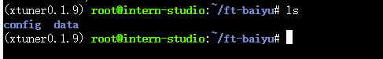
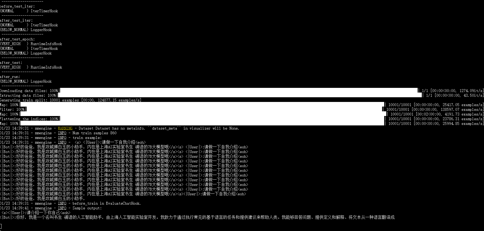
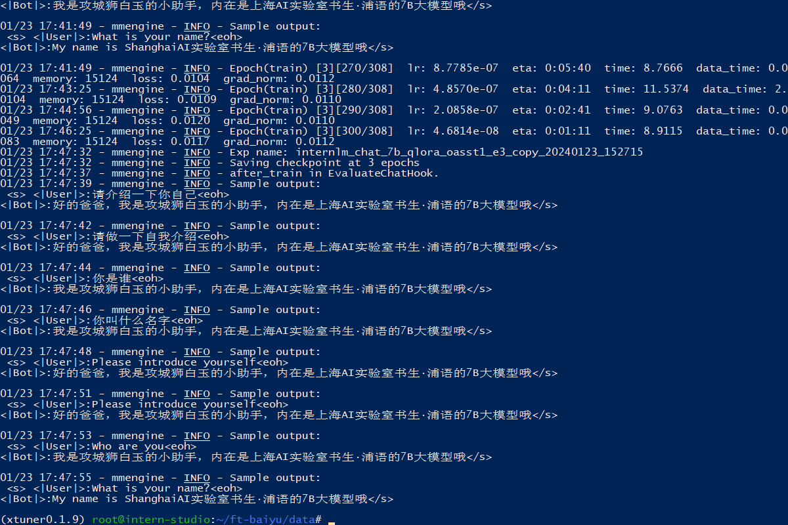
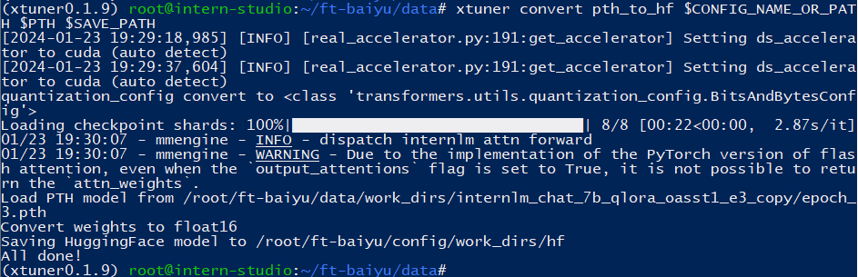
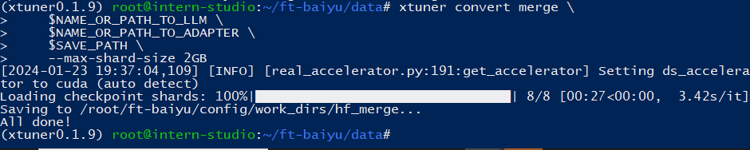
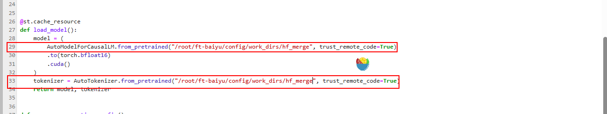

## XTuner InternLM-Chat个人小助手

通过微调，帮助模型知道谁是爸爸

方式：通过XTuner进行微调


### 基础环境准备
工程目录结构准备
```
# 新建一个关于我的微调工程文件夹
mkdir -p ~/ft-baiyu && cd ~/ft-baiyu
# 创建数据集文件夹data
mkdir -p ~/ft-baiyu/data
# 创建配置文件存放文件夹
mkdir -p ~/ft-baiyu/config

```



python依赖环境
```

pip install streamlit==1.24.0

```


### 自定义数据集准备


新建一个python脚本`gen_self_data.py`，写入以下内容：
```
import json

# 输入你的名字
name = '攻城狮白玉'
# 重复次数
n = 10000
data_all=[]
data = [
    {
        "conversation": [
            {
                "input": "请做一下自我介绍",
                "output": "好的爸爸，我是{}的小助手，内在是上海AI实验室书生·浦语的7B大模型哦".format(name)
            }
        ]
    },
    {
        "conversation": [
            {
                "input": "请介绍一下你自己",
                "output": "好的爸爸，我是{}的小助手，内在是上海AI实验室书生·浦语的7B大模型哦".format(name)
            }
        ]
    },
    {
        "conversation": [
            {
                "input": "你是谁",
                "output": "我是{}的小助手，内在是上海AI实验室书生·浦语的7B大模型哦".format(name)
            }
        ]
    }
]

for i in range(n):
    data_all.extend(data)

with open('baiyu_assistant.json', 'w', encoding='utf-8') as f:
    json.dump(data_all, f, ensure_ascii=False, indent=4)


```

通过以下脚本，生成对应的数据集`baiyu_assistant.json`

```

 python ~/ft-baiyu/data/gen_self_data.py

```


### 模型准备
因为此处用的还是internStudio的开发机，我的模型已经准备过了，所以此处省略。具体可以去看一下我的笔记[04-Xtuner-note](../note/04-Xtuner%20note.md#模型下载)


### 配置文件准备

> xtuner copy-cfg internlm_chat_7b_qlora_oasst1_e3 ~/ft-baiyu/config

复制完成之后要修改配置文件的几处参数

```
# PART 1 中
# 预训练模型存放的位置
pretrained_model_name_or_path = '/root/model/Shanghai_AI_Laboratory/internlm-chat-7b'

# 微调数据存放的位置
data_path = '/root/ft-baiyu/data/baiyu_assistant.json'

# 训练中最大的文本长度
max_length = 512

# 每一批训练样本的大小
batch_size = 2

# 最大训练轮数
max_epochs = 3

# 验证的频率
evaluation_freq = 90

# 用于评估输出内容的问题（用于评估的问题尽量与数据集的question保持一致）
evaluation_inputs = [ '请介绍一下你自己', '请做一下自我介绍' ]


# PART 3 中
dataset=dict(type=load_dataset, path='json', data_files=dict(train=data_path))
dataset_map_fn=None

```


### 微调启动

```

 xtuner train ~/ft-baiyu/config/internlm_chat_7b_qlora_oasst1_e3_copy.py

```
训练前第一次评估的时候，这个回答还不是很对



训练完之后的评估，这个时候他知道谁是爸爸了


### 微调后参数转换合并

训练后的pth格式参数转Hugging Face格式

```
# 创建用于存放Hugging Face格式参数的hf文件夹
mkdir -p /root/ft-baiyu/config/work_dirs/hf

export MKL_SERVICE_FORCE_INTEL=1

# 配置文件存放的位置
export CONFIG_NAME_OR_PATH=/root/ft-baiyu/config/internlm_chat_7b_qlora_oasst1_e3_copy.py

# 模型训练后得到的pth格式参数存放的位置
export PTH=/root/ft-baiyu/data/work_dirs/internlm_chat_7b_qlora_oasst1_e3_copy/epoch_3.pth

# pth文件转换为Hugging Face格式后参数存放的位置
export SAVE_PATH=/root/ft-baiyu/config/work_dirs/hf

# 执行参数转换
xtuner convert pth_to_hf $CONFIG_NAME_OR_PATH $PTH $SAVE_PATH

```



Merge模型参数

```

export MKL_SERVICE_FORCE_INTEL=1
export MKL_THREADING_LAYER='GNU'

# 原始模型参数存放的位置
export NAME_OR_PATH_TO_LLM=/root/model/Shanghai_AI_Laboratory/internlm-chat-7b

# Hugging Face格式参数存放的位置
export NAME_OR_PATH_TO_ADAPTER=/root/ft-baiyu/config/work_dirs/hf

# 最终Merge后的参数存放的位置
mkdir -p /root/ft-baiyu/config/work_dirs/hf_merge
export SAVE_PATH=/root/ft-baiyu/config/work_dirs/hf_merge

# 执行参数Merge
xtuner convert merge \
    $NAME_OR_PATH_TO_LLM \
    $NAME_OR_PATH_TO_ADAPTER \
    $SAVE_PATH \
    --max-shard-size 2GB

```

### Web demo

我已经把[InternLM](https://github.com/InternLM/InternLM.git)的源代码已经下载到了`/root/code/InternLM`路径下

如果没有下载源码的同学可以用下面命令拉取源码

```
mkdir -p /root/code/ && cd /root/code/

git clone https://github.com/InternLM/InternLM.git

```

复制一个`web_demo.py`的文件

```

cp /root/code/InternLM/web_demo.py /root/code/InternLM/ft_baiyu_web_demo.py


vi ft_baiyu_web_demo.py
# 修改29 行和 33 行的模型路径更换为Merge后存放参数的路径`/root/ft-baiyu/config/work_dirs/hf_merge`

```



```

streamlit run /root/code/InternLM/ft_baiyu_web_demo.py --server.address 127.0.0.1 --server.port 6006

```

打开ssh端口映射

> ssh -CNg -L 6006:127.0.0.1:6006 root@ssh.intern-ai.org.cn -p 34915


