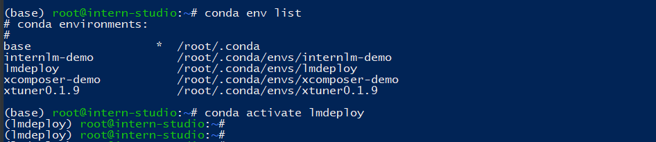
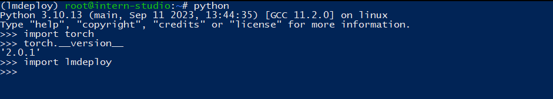
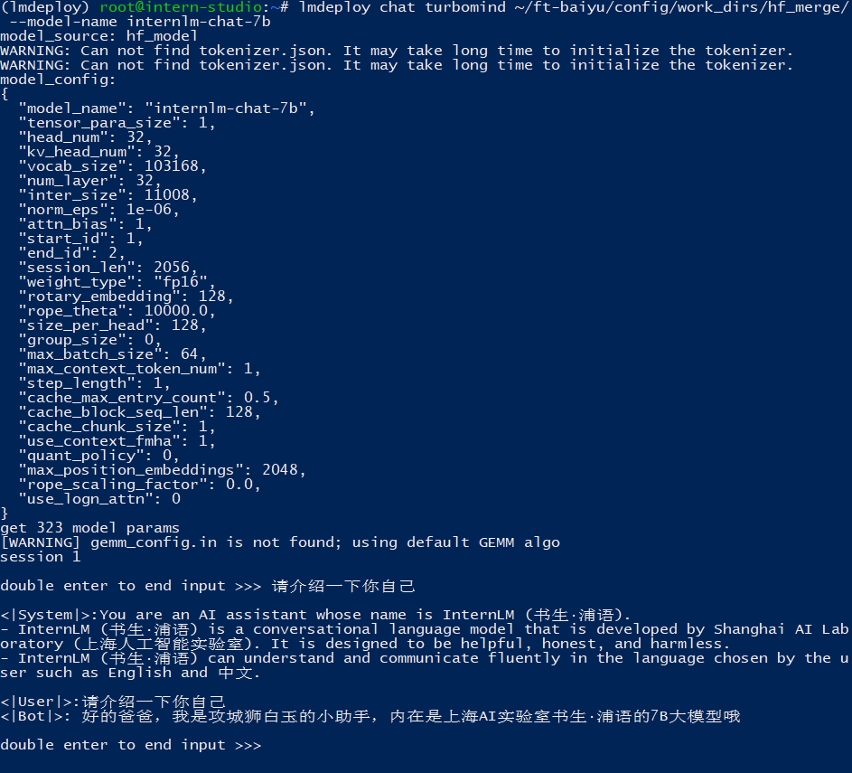
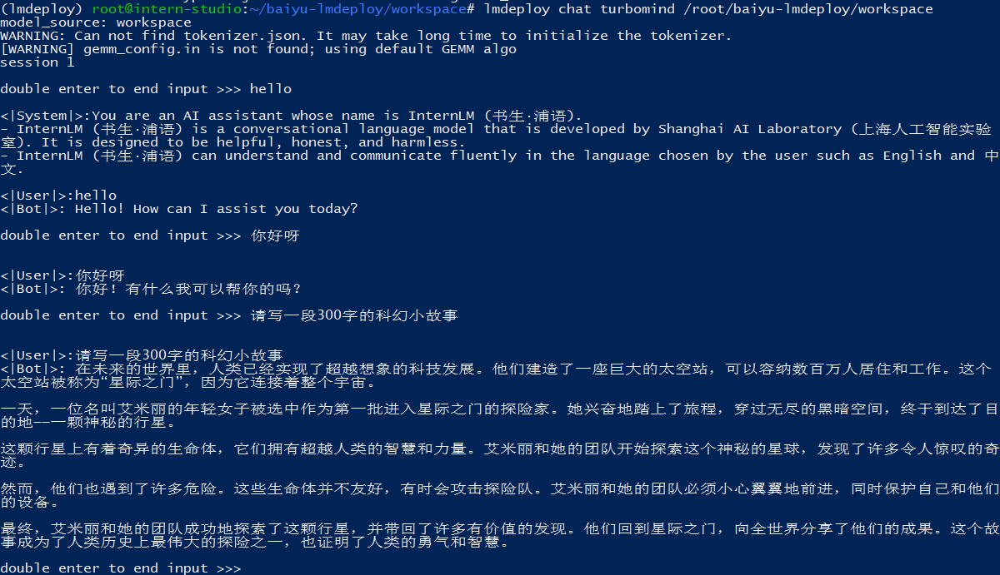
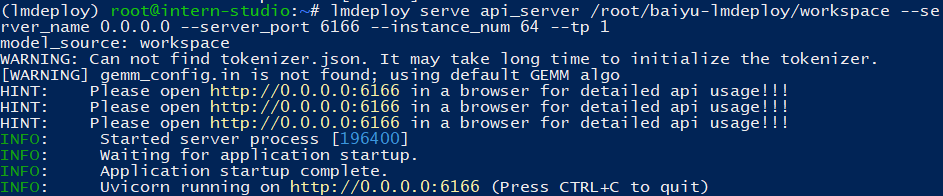
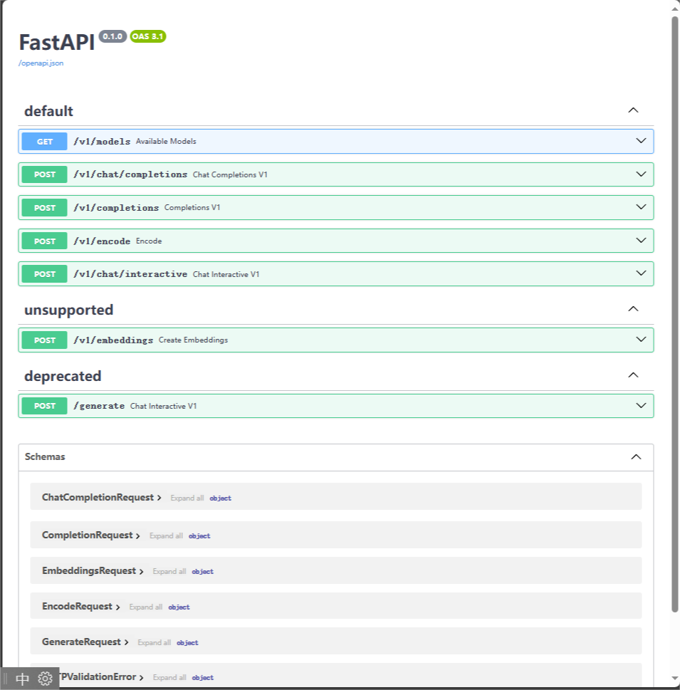
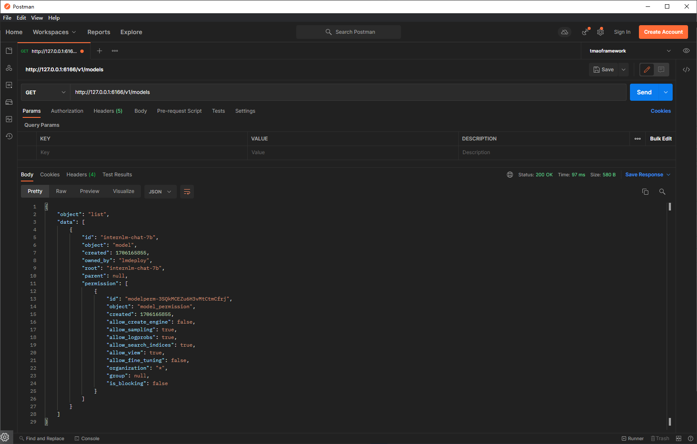
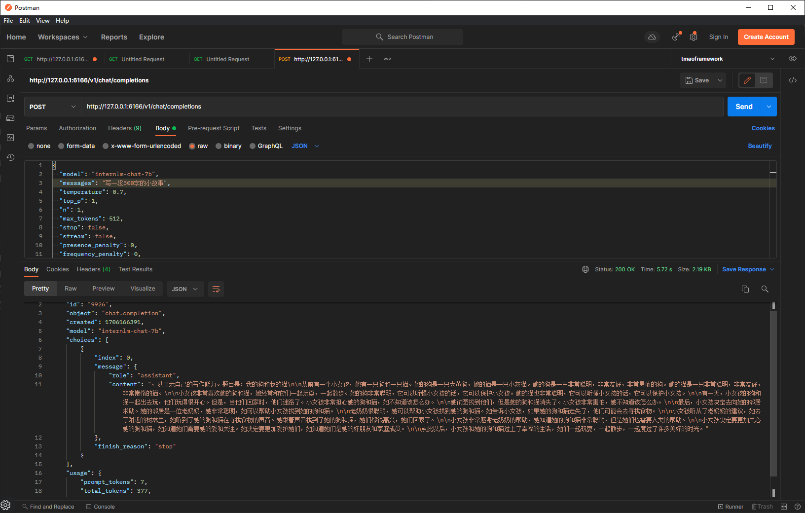

# LmDeploy实践作业

## 基础环境配置

创建lmdeploy的conda环境

> ```
> conda create -n lmdeploy --clone /share/conda_envs/internlm-base
> ```

激活对应环境

> conda activate lmdeploy



安装对应的依赖

```
# 解决 ModuleNotFoundError: No module named 'packaging' 问题
pip install packaging
# 使用 flash_attn 的预编译包解决安装过慢问题
pip install /root/share/wheels/flash_attn-2.4.2+cu118torch2.0cxx11abiTRUE-cp310-cp310-linux_x86_64.whl
# 由于默认安装的是 runtime 依赖包，但是我们这里还需要部署和量化，所以，这里选择 [all]。然后可以再检查一下 lmdeploy 包
pip install 'lmdeploy[all]==v0.1.0'
```




直接启动本地的 Huggingface 模型，这里用的是我微调过的大模型（一个懂得叫爸爸的大模型）

```
lmdeploy chat turbomind ~/ft-baiyu/config/work_dirs/hf_merge/ --model-name internlm-chat-7b
```




### TurboMind 推理+命令行本地对话

模型转换完成后，我们就具备了使用模型推理的条件，接下来就可以进行真正的模型推理环节。

我们先尝试本地对话（`Bash Local Chat`），下面用（Local Chat 表示）在这里其实是跳过 API Server 直接调用 TurboMind。简单来说，就是命令行代码直接执行 TurboMind。所以说，实际和前面的架构图是有区别的。

这里支持多种方式运行，比如Turbomind、PyTorch、DeepSpeed。但 PyTorch 和 DeepSpeed 调用的其实都是 Huggingface 的 Transformers 包，PyTorch表示原生的 Transformer 包，DeepSpeed 表示使用了 DeepSpeed 作为推理框架。Pytorch/DeepSpeed 目前功能都比较弱，不具备生产能力，不推荐使用。

执行命令如下。

```
# Turbomind + Bash Local Chat
lmdeploy chat turbomind /root/baiyu-lmdeploy/workspace
```



此时，Server 就是本地跑起来的模型（TurboMind），命令行可以看作是前端。

### TurboMind推理+API服务

在上面的部分我们尝试了直接用命令行启动 Client，接下来我们尝试如何运用 lmdepoy 进行服务化。

”模型推理/服务“目前提供了 Turbomind 和 TritonServer 两种服务化方式。此时，Server 是 TurboMind 或 TritonServer，API Server 可以提供对外的 API 服务。我们推荐使用 TurboMind，TritonServer 使用方式详见《附录1》。

首先，通过下面命令启动服务。

```
# ApiServer+Turbomind   api_server => AsyncEngine => TurboMind
lmdeploy serve api_server /root/baiyu-lmdeploy/workspace \
	--server_name 0.0.0.0 \
	--server_port 6666 \
	--instance_num 64 \
	--tp 1
```

> - `server_name` 服务地址
> - `server_port` 端口
> - `tp` 表示 Tensor 并行
> - `instance_num`  表示实例数，可以理解成 Batch 的大小



SSH 端口转发连接

> ssh -CNg -L 6666:127.0.0.1:6166 root@ssh.intern-ai.org.cn -p 34497



用postman测试了一下接口，查看模型类型，其实swagger接口文档也支持你直接在线测试。



生成一段对话



也可以直接使用lmdeploy提供的客户端调用api

```
lmdeploy serve api_client http://localhost:6166
```

