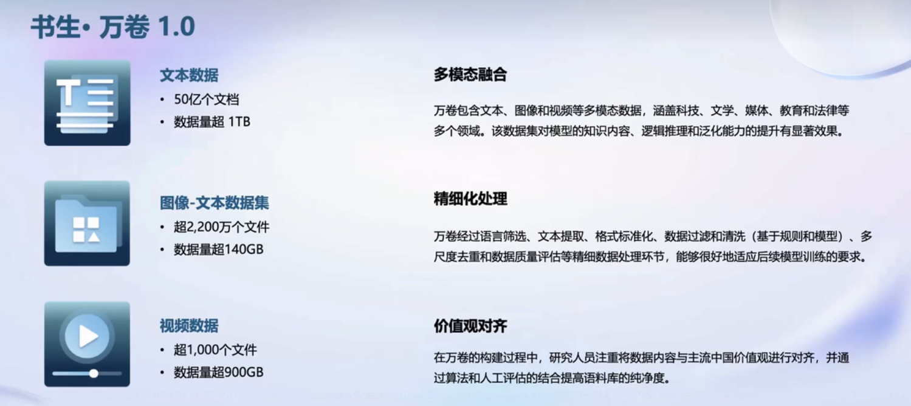
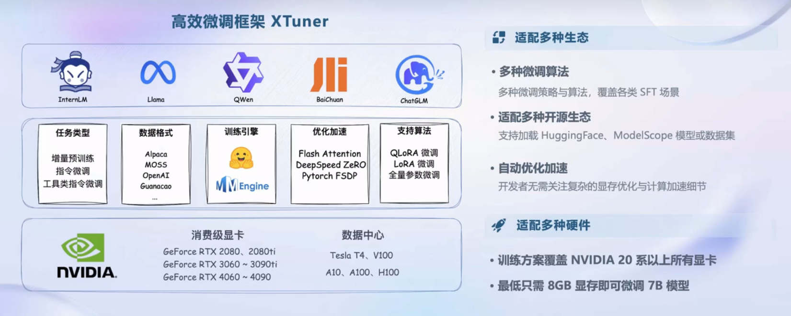

# 书生大模型全链路开源体系学习

![1704782240404](assets/1704782240404.png

书生浦语大模型全链路开源体系开源了哪些东西

- 数据`书生万卷`：一个2TB的涵盖多种模态与任务的数据集
- 预训练`InternLM-Train`：
- 微调`XTuner`：可供你低成本微调模型的工具箱
- 部署`LMDeploy`：一个服务端场景下、transformer 结构 LLM 部署工具。
- 评测`OpenCompass`：开源的大模型评测工具
- 智能体应用
  - Lagent
  - AgentLego

## 数据

### 书生万卷1.0

这个是上海人工智能开源的多模态的数据集，有文本，图像-文本，以及视频数据

网址：https://github.com/opendatalab/WanJuan1.0

## OpenDataLab

除了开源了书生万卷数据集，上海人工智能实验室还提供了OpenDataLab这个数据平台，上面有很多数据集可以下载。而且还提供了数据标注工具

网址：https://opendatalab.com/

## 预训练 InternLM-Train

这个预训练框架的特点

* 高可扩展
* 极致性能优化
* 兼容主流
* 开箱即用

## 微调

在大模型下游的应用中一般用到两种微调方式：增量续训、有监督微调。

* 增量续训是让基座模型学习新知识，如某个垂直领域的知识。此时输入数据一般为专业领域知识文章、书籍等。
* 有监督微调是让大模型学会理解和遵循各种指令，或者注入少量的领域知识。

### XTuner

.XTuner是上海人工智能实验室开发的低成本大模型训练工具箱，只要**8G**。最低只需 **8GB** 显存，就可以微调InternLM-7B模型，打造专属于你的 AI 助手。哎，望了眼我家里不争气的RTX1660Ti

## 评测体系OpenCompass

OpenCompass是什么？上海人工智能实验室推出**OpenCompass大模型开放评测体系**，简称就是OpenCompass

OpenCompass最大的一个特点就是囊括了非常多的数据集以及对应数据集的预处理加工脚本。此外，还支持社区用户根据自身需求快速添加自定义的数据集。

​       **官网链接** [https://opencompass.org.cn](https://opencompass.org.cn/)

​       **开源链接** https://github.com/open-compass/opencompass

## 轻量化部署 LMDeploy

为了解决大语言模型内存开销大，无法在低存储设备上部署推理服务等问题，上海AI实验室推出了LMDeploy的轻量化的部署方案

## 应用

为了让用户更好的发挥大模型的作用，书生通用大模型开源体系提供了两个智能体应用框架

### 轻量级智能体框架Lagent

### 多模态智能体工具箱AgentLego

