# 书生大模型Demo体验

## 配SSH 链接

这里默认你已经生成了ssh密钥，下面的截图只是告知你如何配置SSH公钥在InternStudio上

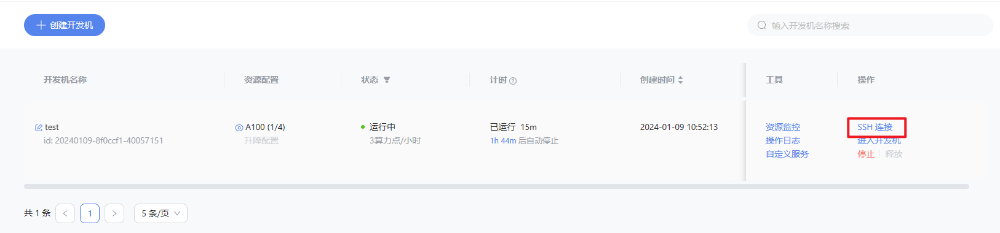

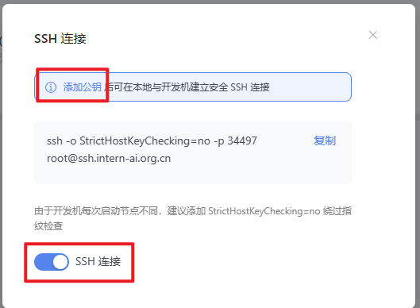

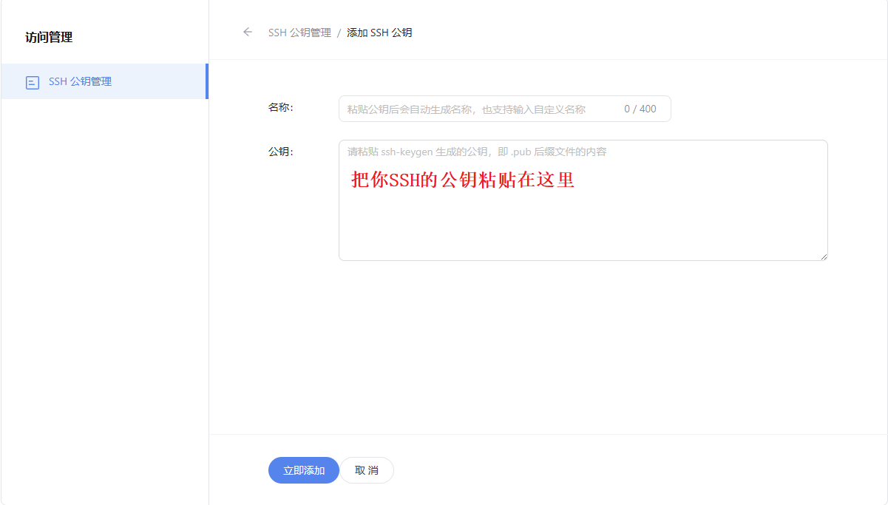

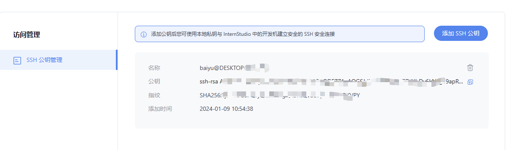


## 环境准备

进入开发机之后，选择终端

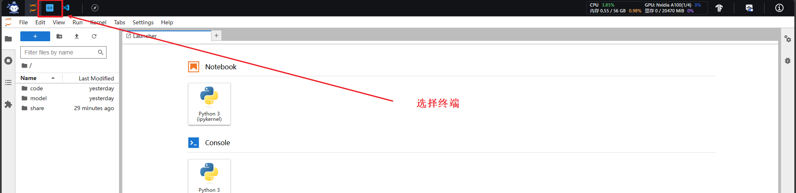

```bash
cd share/
bash  install_conda_env_internlm_base.sh internlm-demo
```

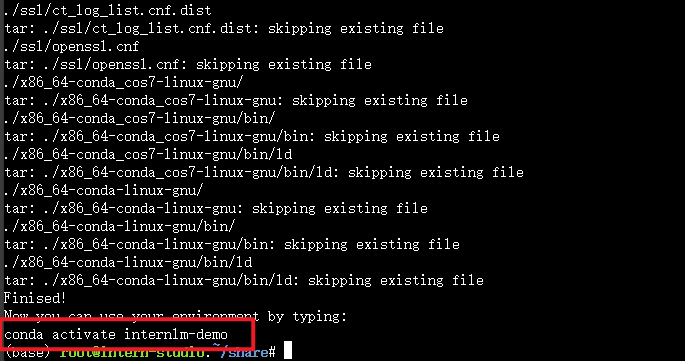

当你看到这句提示语的时候，就可以通过按照提示输入，激活虚拟环境

> conda activate internlm-demo

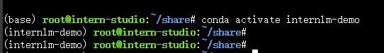

### 安装python相关依赖

```bash
# 升级pip
python -m pip install --upgrade pip
# 安装相关依赖
pip install modelscope==1.9.5
pip install transformers==4.35.2
pip install streamlit==1.24.0
pip install sentencepiece==0.1.99
pip install accelerate==0.24.1
```

### 模型准备

[InternStudio](https://studio.intern-ai.org.cn/) 平台的 `share` 目录下已经为我们准备了全系列的 `InternLM` 模型，所以我们可以直接复制即可。使用如下命令复制：

```shell
mkdir -p /root/model/Shanghai_AI_Laboratory
cp -r /root/share/temp/model_repos/internlm-chat-7b /root/model/Shanghai_AI_Laboratory
```
> -r 选项表示递归地复制目录及其内容

### 使用HuggingFace下载模型

使用 Hugging Face 官方提供的 `huggingface-cli` 命令行工具。安装依赖:

```shell
pip install -U huggingface_hub
```

安装完毕之后就可以直接在命令行使用`huggingface-cli`命令了

我们使用` huggingface-cli download -h`命令查看`huggingface-cli`的下载命令参数

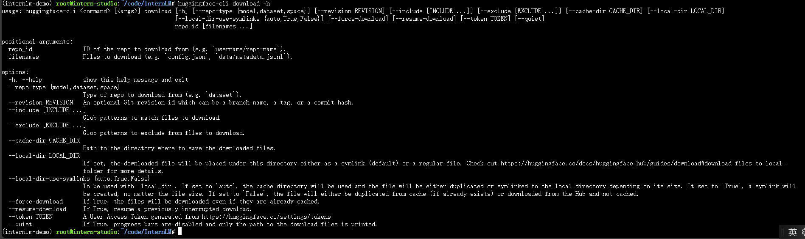

通过命令行下载`internlm-chat-20b`的`config.json`文件

```python
huggingface-cli download --resume-download --local-dir /root/temp internlm/internlm-chat-20b config.json
```

在开发机上毫不意外的报错了，因为huggingface被墙了。

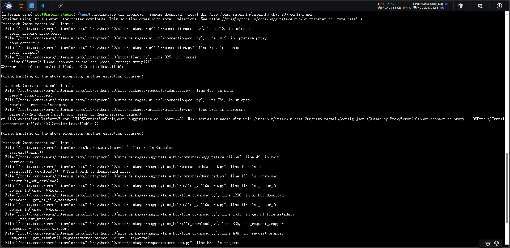

在我本地电脑试了就可以下载

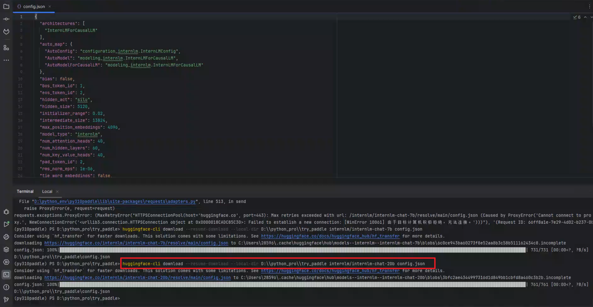

## 用InternLM-7B生成小故事

### 代码准备

首先 `clone` 代码，在 `/root` 路径下新建 `code` 目录，然后切换路径, clone 代码.

```shell
mkdir -p /root/code
cd /root/code
git clone https://gitee.com/internlm/InternLM.git
```

切换 commit 版本，与教程 commit 版本保持一致。

```shell
cd InternLM
git checkout 3028f07cb79e5b1d7342f4ad8d11efad3fd13d17
```

在`/root/code/InternLM/`目录下，新建一个`cli_demo.py`文件

```python
import torch
from transformers import AutoTokenizer, AutoModelForCausalLM

model_name_or_path = "/root/model/Shanghai_AI_Laboratory/internlm-chat-7b"

tokenizer = AutoTokenizer.from_pretrained(model_name_or_path, trust_remote_code=True)
model = AutoModelForCausalLM.from_pretrained(model_name_or_path, trust_remote_code=True, torch_dtype=torch.bfloat16, device_map='auto')
model = model.eval()

system_prompt = """You are an AI assistant whose name is InternLM (书生·浦语).
- InternLM (书生·浦语) is a conversational language model that is developed by Shanghai AI Laboratory (上海人工智能实验室). It is designed to be helpful, honest, and harmless.
- InternLM (书生·浦语) can understand and communicate fluently in the language chosen by the user such as English and 中文.
"""

messages = [(system_prompt, '')]

print("=============Welcome to InternLM chatbot, type 'exit' to exit.=============")

while True:
    input_text = input("User  >>> ")
    input_text = input_text.replace(' ', '')
    if input_text == "exit":
        break
    response, history = model.chat(tokenizer, input_text, history=messages)
    messages.append((input_text, response))
    print(f"robot >>> {response}")
```

### 代码运行

```bash
cd code/InternLM/
python cli_demo.py
```

运行代码即可体验`internlm-7b`大模型的简单交互，我用它写了一个小故事

我的prompt如下

> 人物及关系：白玉和妮妮，白玉是黑客，妮妮是猫
> 事件及冲突：人猫相伴
> 风格及题材：一场星际战争给他们的生活带来了巨大的变数，请在故事中融入了一些现代元素和对人性的思考，加入小动物的暖心片段。

```
标题：人猫相伴，一场星际战争的启示

在一个遥远的星球上，有一只叫做“白玉”的猫，他是一位著名的黑客。他有着超凡的计算机技能和敏锐的观察力，经常在网络上大显身手，引起了其他星球的关注。

一天，白玉收到了一封神秘的邀请函，邀请他去参加一个名为“星际争霸”的比赛。白玉很高兴，因为他一直梦想着能够在宇宙中展示自己的技术。他接受了邀请，并开始准备参加比赛。

在比赛期间，白玉遇到了一个名叫“妮妮”的猫咪。妮妮是一只非常聪明和机智的猫，她的技能在比赛中也相当出色。白玉和妮妮成为了好朋友，他们一起努力训练，希望能够在比赛中取得好成绩。

然而，一场突如其来的星际战争打乱了他们的计划。一场可怕的机器军团入侵了他们的星球，并威胁到了人类的生存。白玉和妮妮决定挺身而出，为保护他们的星球而战。

他们与敌人展开了一场艰苦的战斗，最终，他们成功地摧毁了机器军团。这场战争结束后，白玉和妮妮成为了英雄，他们的勇气和勇气成为了人们的楷模。

在这场战争结束后，白玉和妮妮决定不再隐藏他们的技能和才华。他们开始为星球上的人们服务，保护他们的家园，并在和平与和谐中生活。他们发现，虽然他们来自不同的星球，但他们都有着相同的目标：保护自己和他们的家园。

故事的结尾，白玉和妮妮成为了最好的朋友，并继续在星际中一起冒险，探索新的世界和挑战。
```

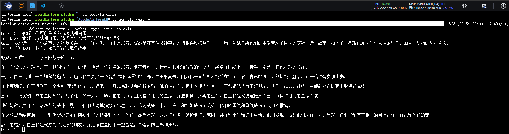

其实生成的内容，我们不难发现，是有逻辑上的问题的，因为白玉不是一只猫，这可能是模型上还有一些参数需要调整。

## web demo体验

```bash
cd /root/code/InternLM
streamlit run web_demo.py --server.address 127.0.0.1 --server.port 6006
```

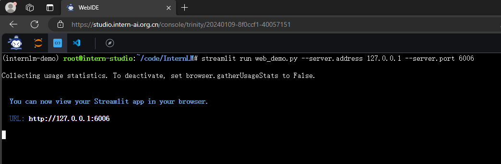

在本地打开powershell，通过ssh进行端口映射

> ssh -CNg -L 6006:127.0.0.1:6006 root@ssh.intern-ai.org.cn -p 34497

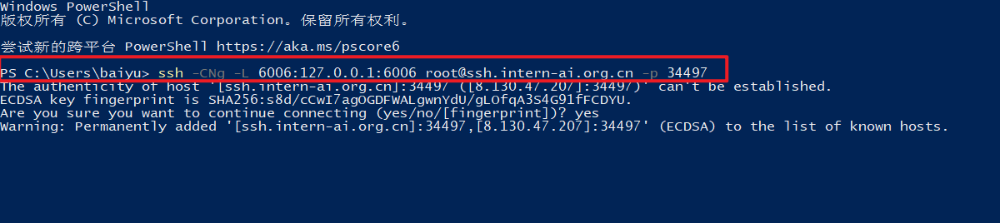

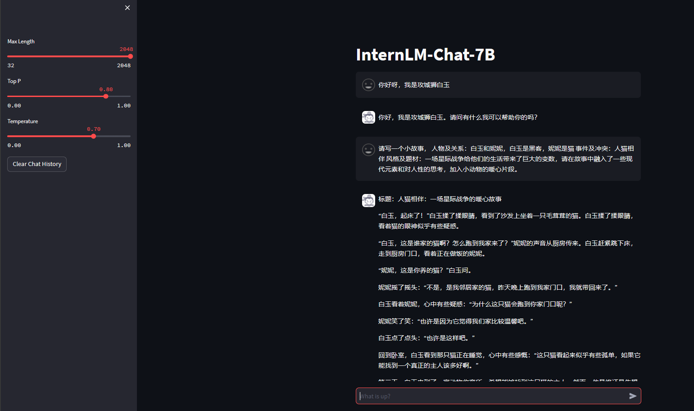

同样的prompt，web_demo的比cli_demo的好很多。生成的故事也好很多，只不过是对于语义的理解还是有问题，比如妮妮是一直猫这个prompt还是没有理解到位

``` bash
标题：人猫相伴：一场星际战争的暖心故事

“白玉，起床了！”白玉揉了揉眼睛，看到了沙发上坐着一只毛茸茸的猫。白玉揉了揉眼睛，看着猫的眼神似乎有些疑惑。
“白玉，这是谁家的猫啊？怎么跑到我家来了？”妮妮的声音从厨房传来。白玉赶紧跳下床，走到厨房门口，看着正在做饭的妮妮。
“妮妮，这是你养的猫？”白玉问。
妮妮摇了摇头：“不是，是我邻居家的猫，昨天晚上跑到我家门口，我就带回来了。”
白玉看着妮妮，心中有些疑惑：“为什么这只猫会跑到你家门口呢？”
妮妮笑了笑：“也许是因为它觉得我们家比较温馨吧。”
白玉点了点头：“也许是这样吧。”
回到卧室，白玉看到那只猫正在睡觉，心中有些感慨：“这只猫看起来似乎有些孤单，如果它能找到一个真正的主人该多好啊。”
第二天，白玉来到了一家动物收容所，希望能够找到这只猫的主人。然而，他最终还是失望了。
“白玉，你要找的那个人不是在这里，”一位工作人员告诉白玉，“他们已经离开了这座城市。”
白玉感到有些失落，他不知道该怎么办才能让这只猫有一个真正的家。
然而，一天晚上，白玉在家里听到了猫的叫声。他走进厨房，看到了那只猫正在家里走动。
“妮妮，这是怎么回事？”白玉问道。
妮妮微笑着：“这只猫似乎很害怕，它一直试图逃跑。但是，它好像不知道该去哪里。”
白玉看着妮妮，心中有些感慨：“或许我们应该把这只猫当做自己的宠物，让它有一个真正的家。”
“是啊，”妮妮点头，“这样它就会不再孤单了。”
从那以后，白玉和妮妮一起照顾那只猫，给它喂食、洗澡，让它感受到家的温暖。
然而，有一天，一场星际战争爆发了。白玉和妮妮不得不离开家，去保护他们的家园。他们不知道这场战争会持续多久，也不知道他们是否能回到自己的家园。
在战争中，白玉和妮妮遇到了许多危险，但他们始终没有忘记那只猫。他们知道，那只猫需要他们的保护和照顾。
最终，战争结束了。白玉和妮妮回到了家，发现那只猫依然在那里，等待着他们的归来。
白玉和妮妮感到十分欣慰，他们知道，他们已经拥有了真正的家。而那只猫，也成为了他们的家人。
```

## Lagent体验

在开发机切换路径到 `/root/code` 克隆 `lagent` 仓库，并通过 `pip install -e .` 源码安装 `Lagent`

```shell
cd /root/code
git clone https://gitee.com/internlm/lagent.git
cd /root/code/lagent
git checkout 511b03889010c4811b1701abb153e02b8e94fb5e # 尽量保证和教程commit版本一致
pip install -e . # 源码安装
```

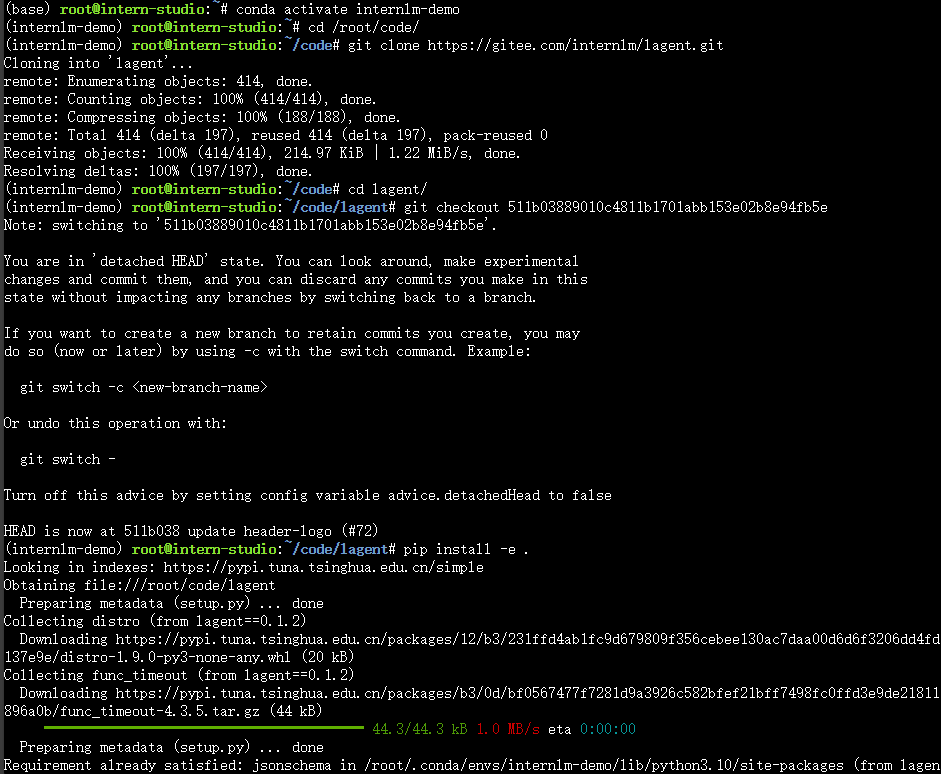

### 新建代码

根据教程，我新建了一个`baiyu_lagent_demo.py`文件，就不做源代码替换了 `/root/code/lagent/examples/baiyu_lagent_demo``.py` 内容替换为以下代码

```python
import copy
import os

import streamlit as st
from streamlit.logger import get_logger

from lagent.actions import ActionExecutor, GoogleSearch, PythonInterpreter
from lagent.agents.react import ReAct
from lagent.llms import GPTAPI
from lagent.llms.huggingface import HFTransformerCasualLM


class SessionState:

    def init_state(self):
        """Initialize session state variables."""
        st.session_state['assistant'] = []
        st.session_state['user'] = []

        #action_list = [PythonInterpreter(), GoogleSearch()]
        action_list = [PythonInterpreter()]
        st.session_state['plugin_map'] = {
            action.name: action
            for action in action_list
        }
        st.session_state['model_map'] = {}
        st.session_state['model_selected'] = None
        st.session_state['plugin_actions'] = set()

    def clear_state(self):
        """Clear the existing session state."""
        st.session_state['assistant'] = []
        st.session_state['user'] = []
        st.session_state['model_selected'] = None
        if 'chatbot' in st.session_state:
            st.session_state['chatbot']._session_history = []


class StreamlitUI:

    def __init__(self, session_state: SessionState):
        self.init_streamlit()
        self.session_state = session_state

    def init_streamlit(self):
        """Initialize Streamlit's UI settings."""
        st.set_page_config(
            layout='wide',
            page_title='lagent-web',
            page_icon='./docs/imgs/lagent_icon.png')
        # st.header(':robot_face: :blue[Lagent] Web Demo ', divider='rainbow')
        st.sidebar.title('模型控制')

    def setup_sidebar(self):
        """Setup the sidebar for model and plugin selection."""
        model_name = st.sidebar.selectbox(
            '模型选择：', options=['gpt-3.5-turbo','internlm'])
        if model_name != st.session_state['model_selected']:
            model = self.init_model(model_name)
            self.session_state.clear_state()
            st.session_state['model_selected'] = model_name
            if 'chatbot' in st.session_state:
                del st.session_state['chatbot']
        else:
            model = st.session_state['model_map'][model_name]

        plugin_name = st.sidebar.multiselect(
            '插件选择',
            options=list(st.session_state['plugin_map'].keys()),
            default=[list(st.session_state['plugin_map'].keys())[0]],
        )

        plugin_action = [
            st.session_state['plugin_map'][name] for name in plugin_name
        ]
        if 'chatbot' in st.session_state:
            st.session_state['chatbot']._action_executor = ActionExecutor(
                actions=plugin_action)
        if st.sidebar.button('清空对话', key='clear'):
            self.session_state.clear_state()
        uploaded_file = st.sidebar.file_uploader(
            '上传文件', type=['png', 'jpg', 'jpeg', 'mp4', 'mp3', 'wav'])
        return model_name, model, plugin_action, uploaded_file

    def init_model(self, option):
        """Initialize the model based on the selected option."""
        if option not in st.session_state['model_map']:
            if option.startswith('gpt'):
                st.session_state['model_map'][option] = GPTAPI(
                    model_type=option)
            else:
                st.session_state['model_map'][option] = HFTransformerCasualLM(
                    '/root/model/Shanghai_AI_Laboratory/internlm-chat-7b')
        return st.session_state['model_map'][option]

    def initialize_chatbot(self, model, plugin_action):
        """Initialize the chatbot with the given model and plugin actions."""
        return ReAct(
            llm=model, action_executor=ActionExecutor(actions=plugin_action))

    def render_user(self, prompt: str):
        with st.chat_message('user'):
            st.markdown(prompt)

    def render_assistant(self, agent_return):
        with st.chat_message('assistant'):
            for action in agent_return.actions:
                if (action):
                    self.render_action(action)
            st.markdown(agent_return.response)

    def render_action(self, action):
        with st.expander(action.type, expanded=True):
            st.markdown(
                "<p style='text-align: left;display:flex;'> <span style='font-size:14px;font-weight:600;width:70px;text-align-last: justify;'>插    件</span><span style='width:14px;text-align:left;display:block;'>:</span><span style='flex:1;'>"  # noqa E501
                + action.type + '</span></p>',
                unsafe_allow_html=True)
            st.markdown(
                "<p style='text-align: left;display:flex;'> <span style='font-size:14px;font-weight:600;width:70px;text-align-last: justify;'>思考步骤</span><span style='width:14px;text-align:left;display:block;'>:</span><span style='flex:1;'>"  # noqa E501
                + action.thought + '</span></p>',
                unsafe_allow_html=True)
            if (isinstance(action.args, dict) and 'text' in action.args):
                st.markdown(
                    "<p style='text-align: left;display:flex;'><span style='font-size:14px;font-weight:600;width:70px;text-align-last: justify;'> 执行内容</span><span style='width:14px;text-align:left;display:block;'>:</span></p>",  # noqa E501
                    unsafe_allow_html=True)
                st.markdown(action.args['text'])
            self.render_action_results(action)

    def render_action_results(self, action):
        """Render the results of action, including text, images, videos, and
        audios."""
        if (isinstance(action.result, dict)):
            st.markdown(
                "<p style='text-align: left;display:flex;'><span style='font-size:14px;font-weight:600;width:70px;text-align-last: justify;'> 执行结果</span><span style='width:14px;text-align:left;display:block;'>:</span></p>",  # noqa E501
                unsafe_allow_html=True)
            if 'text' in action.result:
                st.markdown(
                    "<p style='text-align: left;'>" + action.result['text'] +
                    '</p>',
                    unsafe_allow_html=True)
            if 'image' in action.result:
                image_path = action.result['image']
                image_data = open(image_path, 'rb').read()
                st.image(image_data, caption='Generated Image')
            if 'video' in action.result:
                video_data = action.result['video']
                video_data = open(video_data, 'rb').read()
                st.video(video_data)
            if 'audio' in action.result:
                audio_data = action.result['audio']
                audio_data = open(audio_data, 'rb').read()
                st.audio(audio_data)


def main():
    logger = get_logger(__name__)
    # Initialize Streamlit UI and setup sidebar
    if 'ui' not in st.session_state:
        session_state = SessionState()
        session_state.init_state()
        st.session_state['ui'] = StreamlitUI(session_state)

    else:
        st.set_page_config(
            layout='wide',
            page_title='lagent-web',
            page_icon='./docs/imgs/lagent_icon.png')
        # st.header(':robot_face: :blue[Lagent] Web Demo ', divider='rainbow')
    model_name, model, plugin_action, uploaded_file = st.session_state[
        'ui'].setup_sidebar()

    # Initialize chatbot if it is not already initialized
    # or if the model has changed
    if 'chatbot' not in st.session_state or model != st.session_state[
            'chatbot']._llm:
        st.session_state['chatbot'] = st.session_state[
            'ui'].initialize_chatbot(model, plugin_action)

    for prompt, agent_return in zip(st.session_state['user'],
                                    st.session_state['assistant']):
        st.session_state['ui'].render_user(prompt)
        st.session_state['ui'].render_assistant(agent_return)
    # User input form at the bottom (this part will be at the bottom)
    # with st.form(key='my_form', clear_on_submit=True):

    if user_input := st.chat_input(''):
        st.session_state['ui'].render_user(user_input)
        st.session_state['user'].append(user_input)
        # Add file uploader to sidebar
        if uploaded_file:
            file_bytes = uploaded_file.read()
            file_type = uploaded_file.type
            if 'image' in file_type:
                st.image(file_bytes, caption='Uploaded Image')
            elif 'video' in file_type:
                st.video(file_bytes, caption='Uploaded Video')
            elif 'audio' in file_type:
                st.audio(file_bytes, caption='Uploaded Audio')
            # Save the file to a temporary location and get the path
            file_path = os.path.join(root_dir, uploaded_file.name)
            with open(file_path, 'wb') as tmpfile:
                tmpfile.write(file_bytes)
            st.write(f'File saved at: {file_path}')
            user_input = '我上传了一个图像，路径为: {file_path}. {user_input}'.format(
                file_path=file_path, user_input=user_input)
        agent_return = st.session_state['chatbot'].chat(user_input)
        st.session_state['assistant'].append(copy.deepcopy(agent_return))
        logger.info(agent_return.inner_steps)
        st.session_state['ui'].render_assistant(agent_return)


if __name__ == '__main__':
    root_dir = os.path.dirname(os.path.dirname(os.path.abspath(__file__)))
    root_dir = os.path.join(root_dir, 'tmp_dir')
    os.makedirs(root_dir, exist_ok=True)
    main()
```

### 代码运行

```shell
streamlit run /root/code/lagent/examples/baiyu_lagent_demo.py --server.address 127.0.0.1 --server.port 6006
```

将端口映射到本地。在本地浏览器输入 `http://127.0.0.1:6006` 即可。

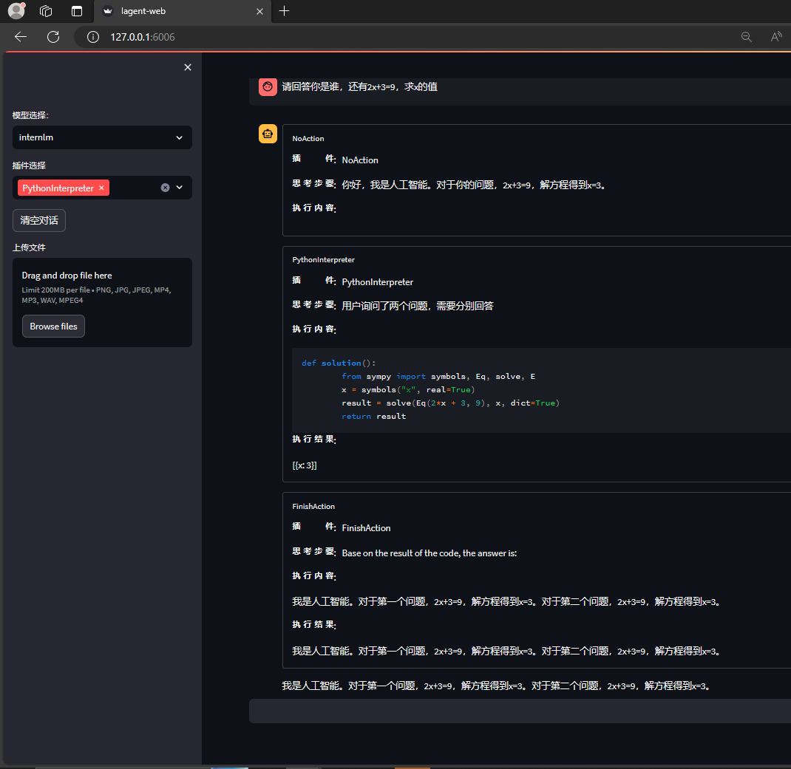

我们在 `Web` 页面选择 `InternLM` 模型，等待模型加载完毕后，

输入我的问题，我一共问了它两个问题，一个文字题你是谁，一个是数学题数学问题  `2x+3=9`，求`x` 

此时 `InternLM-Chat-7B` 模型理解题意生成解此题的 `Python` 代码，`Lagent` 调度送入 `Python` 代码解释器求出该问题的解。

它知道是两个问题，不过它错以为两个问题都是数学题，虽然回答上已经告诉了我它是谁，但是语言逻辑上还是有问题。

## 浦语灵笔体验

浦语灵笔由于涉及到更多的算力处理，所以重新在InternStudio上创建一个新的开发机 A100(1/4) * 2 机器。

这里图文创作用到的模型是`internlm-xcomposer-7b`，我们需要在开发机内新建一个虚拟环境。

具体步骤，在终端输入 `bash` 命令，进入 `conda` 环境。进入 `conda` 环境之后，使用以下命令从本地克隆一个已有的`pytorch 2.0.1` 的环境

> /root/share/install_conda_env_internlm_base.sh xcomposer-demo

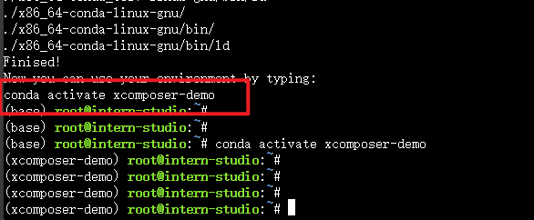

看到红框的命令说明环境创建完成

激活虚拟环境`xcomposer-demo`，就是我们上一句命令创建的虚拟环境

> conda activate xcomposer-demo

### 相关依赖

因为是新机器，新的conda环境，所以要初始化依赖

```bash
# 升级pip
python -m pip install --upgrade pip

pip install transformers==4.33.1 timm==0.4.12 sentencepiece==0.1.99 gradio==3.44.4 markdown2==2.4.10 xlsxwriter==3.1.2 einops accelerate
```


### 模型准备

[InternStudio](https://studio.intern-ai.org.cn/)平台的 `share` 目录下已经为我们准备了全系列的 `InternLM` 模型，所以我们可以直接复制`internlm-xcomposer-7b`模型即可。使用如下命令复制：

```shell
mkdir -p /root/model/Shanghai_AI_Laboratory # 这一句可以不用执行，因为前面我们已经创建过了
cp -r /root/share/temp/model_repos/internlm-xcomposer-7b /root/model/Shanghai_AI_Laboratory
```
> -r 选项表示递归地复制目录及其内容

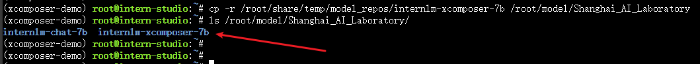

### 代码准备

在 `/root/code` `git clone InternLM-XComposer` 仓库的代码

```shell
cd /root/code
git clone https://gitee.com/internlm/InternLM-XComposer.git
cd /root/code/InternLM-XComposer
git checkout 3e8c79051a1356b9c388a6447867355c0634932d  # 最好保证和教程的 commit 版本一致
```

### Demo 运行

在终端运行以下代码：

```shell
cd /root/code/InternLM-XComposer
python examples/web_demo.py  \
    --folder /root/model/Shanghai_AI_Laboratory/internlm-xcomposer-7b \
    --num_gpus 1 \
    --port 6006
```

> 这里 `num_gpus 1` 是因为InternStudio平台对于 `A100(1/4)*2` 识别仍为一张显卡。但如果有小伙伴课后使用两张 3090 来运行此 demo，仍需将 `num_gpus` 设置为 `2` 。

### SSH链接

> ssh -CNg -L 6006:127.0.0.1:6006 root@ssh.intern-ai.org.cn -p 34915

访问本地链接，我让它以《如何成为一名prompt工程师》为标题写文章

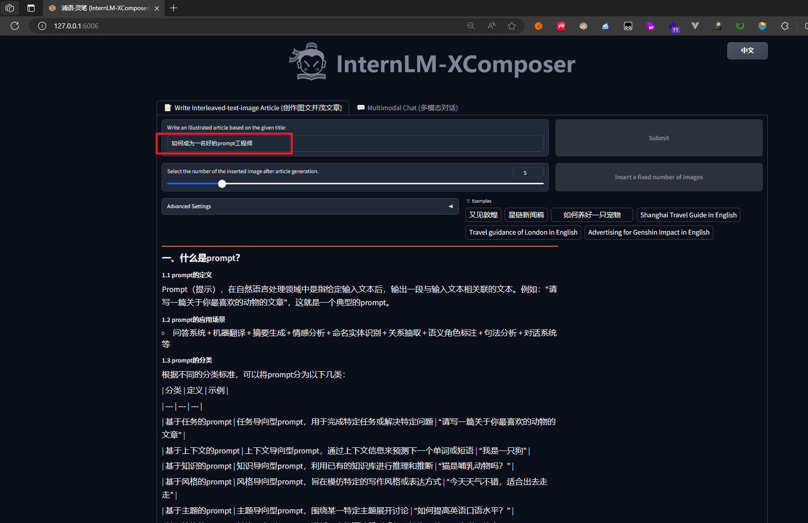

下图是运行时命令行的显示

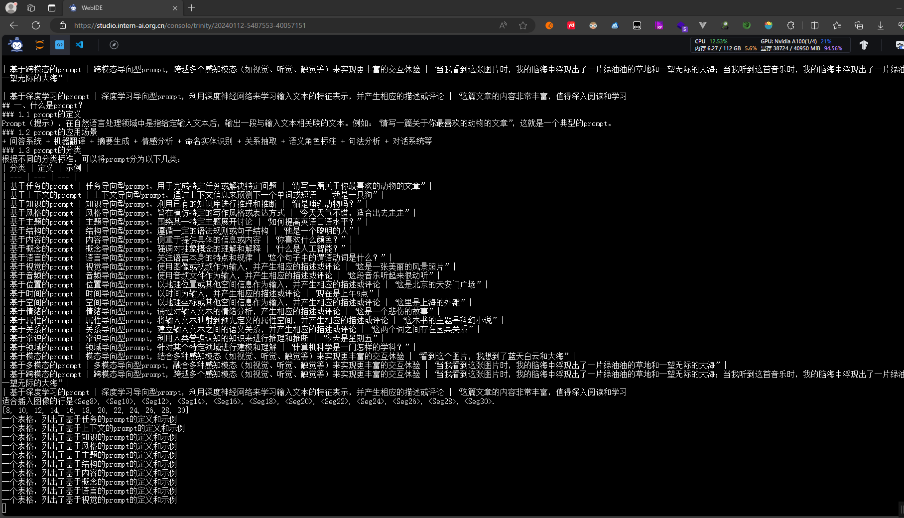

下图是效果

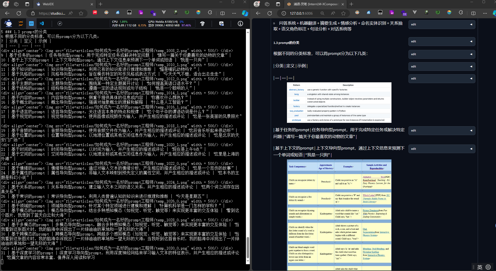

点击save article，把文件保存，我也把生成的文件放在这里供大家阅读~