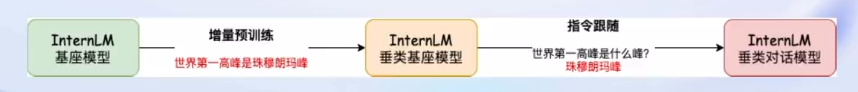
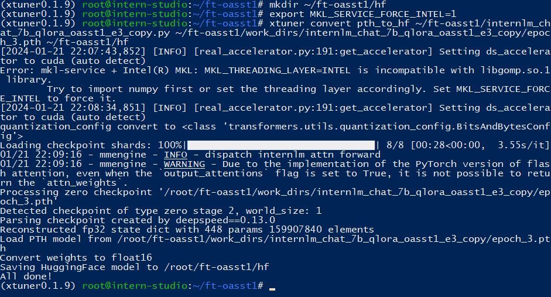

## Finetune简介

LLM的下游应用中。增量预训练和指令跟随是经常会用到的两种微调模式

增量预训练微调

* 使用场景：让基座模型学习到一些新知识，如某个垂类领域的常识
* 训练数据：文章、书籍、代码等

指令跟随微调

* 使用场景：让模型学会对话模板，根据人类指令进行对话
* 训练数据：高质量的对话、问答数据



## Xtuner简介

一个大语言模型微调工具箱。*由* *MMRazor* *和* *MMDeploy* *联合开发。*

### Xtuner特点

- **傻瓜化：** 以 配置文件 的形式封装了大部分微调场景，**0基础的非专业人员也能一键开始微调**。
- **轻量级：** 对于 7B 参数量的LLM，**微调所需的最小显存仅为 8GB** ： **消费级显卡✅，colab✅**

## 环境准备

### 创建conda环境

```
# 如果你是在 InternStudio 平台，则从本地 clone 一个已有 pytorch 2.0.1 的环境：
/root/share/install_conda_env_internlm_base.sh xtuner0.1.9
# 如果你是在其他平台：
conda create --name xtuner0.1.9 python=3.10 -y
```

看到下面提示，说明环境创建完毕


### 激活conda环境

>  conda activate xtuner0.1.9

### 拉取xtuner源码

```
mkdir -p ~/xtuner019 && cd ~/xtuner019
# 拉取 0.1.9 的版本源码
git clone -b v0.1.9 https://gitee.com/Internlm/xtuner
```

## 安装XTuner

进入源码目录，并从源码安装 XTuner

> cd xtuner && pip install -e '.[all]'


直接在命令行输入`xtuner`查看`xtuner`命令如何使用


查看xtuner版本`xtuner version`


xtuner使用简介

```
# 1. 列出xtuner所有内置配置文件:
xtuner list-cfg
# 2. 复制内置配置文件到指定目录:
xtuner copy-cfg $CONFIG $SAVE_FILE
# 3-1. GPU单卡微调大模型:
xtuner train $CONFIG
# 3-2. GPU多卡微调大模型:
NPROC_PER_NODE=$NGPUS NNODES=$NNODES NODE_RANK=$NODE_RANK PORT=$PORT ADDR=$ADDR xtuner dist_train $CONFIG $GPUS
# 4-1. 把pth模型转换成HuggingFace模型:
xtuner convert pth_to_hf $CONFIG $PATH_TO_PTH_MODEL $SAVE_PATH_TO_HF_MODEL
# 4-2. 将HuggingFace的适配器合并到预训练的LLM:
xtuner convert merge $NAME_OR_PATH_TO_LLM $NAME_OR_PATH_TO_ADAPTER $SAVE_PATH
# 4-3. 把HuggingFace的LLM拆分为最小的碎片:
xtuner convert split $NAME_OR_PATH_TO_LLM $SAVE_PATH
# 5. 使用HuggingFace的型号和适配器与LLM聊天:
xtuner chat $NAME_OR_PATH_TO_LLM --adapter $NAME_OR_PATH_TO_ADAPTER --prompt-template $PROMPT_TEMPLATE --system-template $SYSTEM_TEMPLATE
# 6-1. 预处理arxiv数据集:
xtuner preprocess arxiv $SRC_FILE $DST_FILE --start-date $START_DATE --categories $CATEGORIES
# 7-1. 日志处理数据集:
xtuner log-dataset $CONFIG
# 7-2. 验证自定义数据集的配置文件正确性：
xtuner check-custom-dataset
```

我们查看xtuner的内置配置文件

> xtuner list-cfg


### 配置文件名的解释

以`internlm_chat_7b_qlora_oasst1_e3`配置文件举例

| 模型名         | internlm_chat_7b     |
| -------------- | -------------------- |
| 使用算法       | qlora                |
| 数据集         | oasst1               |
| 把数据集跑几次 | 跑3次：e3 (epoch 3 ) |

* 无 chat比如 `internlm-7b` 代表是基座(base)模型

## 模型数据准备

### 配置文件

```
# 创建一个微调 oasst1 数据集的工作路径，进入
mkdir ~/ft-oasst1 && cd ~/ft-oasst1
# 复制xtuner内置的配置文件到 ~/ft-oasst1 目录下
xtuner copy-cfg internlm_chat_7b_qlora_oasst1_e3 ~/ft-oasst1
```


### 模型下载

方式一：我这里直接使用InternStudio平台提供的模型

> cp -r /root/share/temp/model_repos/internlm-chat-7b ~/ft-oasst1/


方式二：从ModelScope下载模型文件

```
# 创建一个目录，放模型文件，防止散落一地
mkdir ~/ft-oasst1/internlm-chat-7b

# 装一下拉取模型文件要用的库
pip install modelscope

# 从 modelscope 下载下载模型文件
cd ~/ft-oasst1
apt install git git-lfs -y
git lfs install
git lfs clone https://modelscope.cn/Shanghai_AI_Laboratory/internlm-chat-7b.git -b v1.0.3
```

### 数据集准备

> cp -r /root/share/temp/datasets/openassistant-guanaco ~/ft-oasst1


一切准备完毕之后，可以用`tree`命令查看`~/ft-oasst1`目录下的文件组成


### 修改配置文件

将`/root/ft-oasst1/internlm_chat_7b_qlora_oasst1_e3_copy.py`文件里的模型和数据集修改为本地路径

* pretrained_model_name_or_path = './internlm-chat-7b'
* data_path = './openassistant-guanaco'


配置文件的常用参数介绍

| 参数名              | 解释                                                   |
| ------------------- | ------------------------------------------------------ |
| **data_path**       | 数据路径或 HuggingFace 仓库名                          |
| max_length          | 单条数据最大 Token 数，超过则截断                      |
| pack_to_max_length  | 是否将多条短数据拼接到 max_length，提高 GPU 利用率     |
| accumulative_counts | 梯度累积，每多少次 backward 更新一次参数               |
| evaluation_inputs   | 训练过程中，会根据给定的问题进行推理，便于观测训练状态 |
| evaluation_freq     | Evaluation 的评测间隔 iter 数                          |

## 开始微调

### 训练

执行训练命令，并通过deepspeed进行训练加速

> xtuner train ~/ft-oasst1/internlm_chat_7b_qlora_oasst1_e3_copy.py --deepspeed deepspeed_zero2

此时预计要9个小时才能训练完


时间太久了，我就把 `max_length` 和 `batch_size` 这两个参数调大。这里我是用的A100(1/4)*2

* max_length=2048
* batch_size=8

这个时候训练的时间就变成两个半小时了，那就静候佳音吧


经过漫长的等待，终于跑完了


训练完，在我们的配置文件目录下，出现一个`work_dirs`目录，具体内容如下图所示：


### 转换HF模型

将得到的 PTH 模型转换为 HuggingFace 模型，**即：生成 Adapter 文件夹**

> xtuner convert pth_to_hf ${CONFIG_NAME_OR_PATH} ${PTH_file_dir} ${SAVE_PATH}

* CONFIG_NAME_OR_PATH=~/ft-oasst1/internlm_chat_7b_qlora_oasst1_e3_copy.py
* PTH_file_dir=~/ft-oasst1/work_dirs/internlm_chat_7b_qlora_oasst1_e3_copy/epoch_3.pth
* SAVE_PATH=~/ft-oasst1/hf

```
# 新建模型存放的文件夹
mkdir ~/ft-oasst1/hf
# 添加环境变量
export MKL_SERVICE_FORCE_INTEL=1
# 模型转换
xtuner convert pth_to_hf ~/ft-oasst1/internlm_chat_7b_qlora_oasst1_e3_copy.py ~/ft-oasst1/work_dirs/internlm_chat_7b_qlora_oasst1_e3_copy/epoch_3.pth ~/ft-oasst1/hf
```



```
# 进入hf文件夹
cd ~/ft-oasst1/hf 
# 查看文件夹下文件
ll
```


**此时，hf 文件夹即为我们平时所理解的所谓 “LoRA 模型文件”**

> 可以简单理解：LoRA 模型文件 = Adapter

## 部署与测试

### 合并HF adapter 到LLM

```
mkdir ~/ft-oasst1/merged
xtuner convert merge ~/ft-oasst1/internlm-chat-7b  ~/ft-oasst1/hf  ~/ft-oasst1/merged --max-shard-size 2GB
```


与合并后的模型对话

```
# 加载 Adapter 模型对话（Float 16）
xtuner chat ~/ft-oasst1/merged --prompt-template internlm_chat

# 4 bit 量化加载
# xtuner chat ~/ft-oasst1/merged --bits 4 --prompt-template internlm_chat
```


