## 大模型部署相关背景知识

### 模型部署定义

* 将训练好的模型在特定软硬件环境中启动的过程，使模型能够接收输入并返回预测结果。
* 为了满足性能和效率的需求，常常需要对模型进行优化，例如模型压缩和硬件加速

#### 产品形态

* 云端、边缘计算端、移动端

#### 计算设备

* CPU、GPU、NPU、TPU等

### 大模型特点

#### 内存开销巨大

* 庞大的参数量。7B 模型仅权重就需要 14+G 内存
* 采用自回归生成 token，需要缓存 Attention 的 k/v,带来巨大的内存开销

#### 动态shape

* 请求数不固定
* Token 逐个生成，且数量不定

#### 相对视觉模型，LLM结构简单

* Transformers 结构，大部分是 decoder-only

### 大模型部署挑战

#### 设备

* 如何应对巨大的存储问题? 
* 低存储设备 (消费级显卡、手机等)如何部署?

#### 推理

* 如何加速 token 的生成速度
* 如何解决动态shape，让推理可以不间断
* 如何有效管理和利用内存

#### 服务

* 如何提升系统整体吞吐量?
* 对于个体用户，如何降低响应时间?

### 大模型部署方案

#### 技术点

* transformer 计算和访存优化
* 模型并行
* 低比特量化
* Continuous Batch
* Page Attention

#### 方案

* huggingface transformers
* 专门的推理加速框架
  * 云端
    * Imdeploy
    * vllm
    * tensorrt-Ilm
    * deepspeed
  * 移动端
    * llama.cpp
    * mlc-Ilm 

## 核心功能

### 量化

两个基本概念

* 计算密集 (compute-bound) ：推理的绝大部分时间消耗在数值计算上；针对计算密集场景，可以通过使用更快的硬件计算单元来提升计算速度比如量化为 W8A8 使用INT8 Tensor Core 来加速计算。
* 访存密集 (memory-bound)： 推理时，绝大部分时间消耗在数据读取上;针对访存密集型场景，一般是通过提高计算访存比来提升性能。


#### LLM 是典型的访存密集型任务

常见的 LLM 模型是 Decoder Only 架构。推理时大部分时间消耗在逐Token 生成阶段(Decoding 阶段)，是典型的访存密集型场景。

### 推理引擎TurboMind（最核心功能）

TurboMind 是一款关于 LLM 推理的高效推理引擎，基于英伟达的 [FasterTransformer](https://github.com/NVIDIA/FasterTransformer) 研发而成。它的主要功能包括：LLaMa 结构模型的支持，persistent batch 推理模式和可扩展的 KV 缓存管理器。


#### 有状态推理

#### 无状态推理


## 动手实操

### 基础环境配置

创建lmdeploy的conda环境

> ```
> conda create -n lmdeploy --clone /share/conda_envs/internlm-base
> ```

激活对应环境

> conda activate lmdeploy

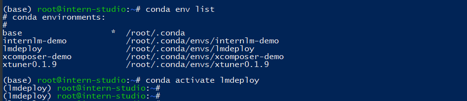

安装对应的依赖

```
# 解决 ModuleNotFoundError: No module named 'packaging' 问题
pip install packaging
# 使用 flash_attn 的预编译包解决安装过慢问题
pip install /root/share/wheels/flash_attn-2.4.2+cu118torch2.0cxx11abiTRUE-cp310-cp310-linux_x86_64.whl
# 由于默认安装的是 runtime 依赖包，但是我们这里还需要部署和量化，所以，这里选择 [all]。然后可以再检查一下 lmdeploy 包
pip install 'lmdeploy[all]==v0.1.0'
```

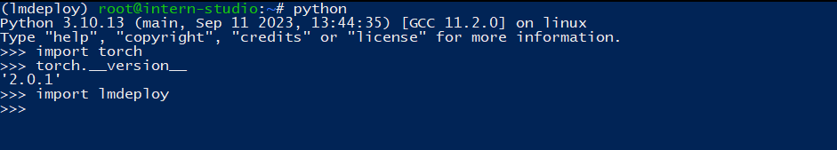

### 模型转换

使用 TurboMind 推理模型需要先将模型转化为 TurboMind 的格式，目前支持**在线转换**和**离线转换**两种形式。

* 在线转换可以直接加载 Huggingface 模型
* 离线转换需需要先保存模型再加载。

#### 在线转换

加载使用 lmdeploy 量化的版本

```
lmdeploy chat turbomind internlm/internlm-chat-20b-4bit --model-name internlm-chat-20b
```

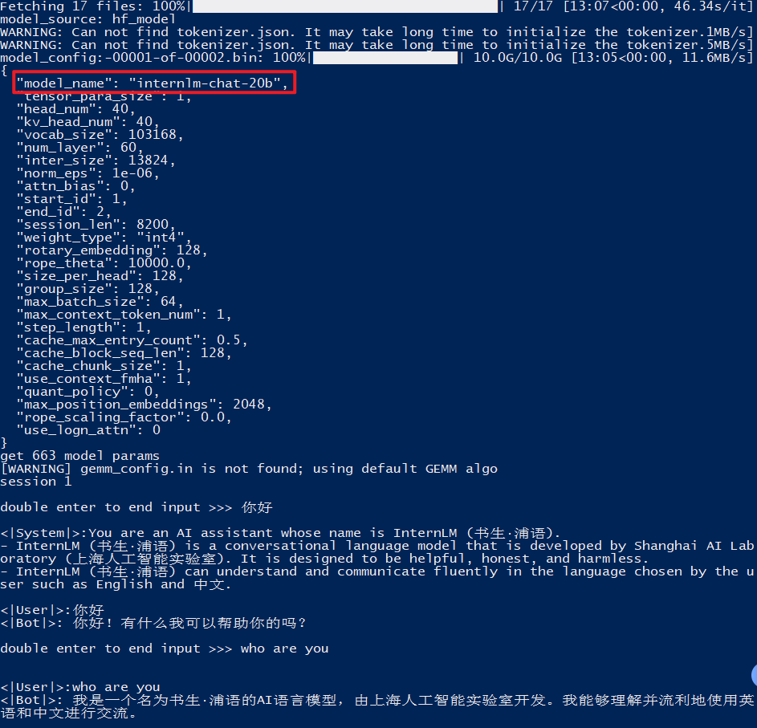

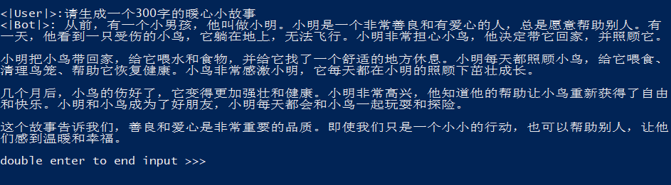

通过LmDeploy在线加载QWen LLM 模型

```
lmdeploy chat turbomind Qwen/Qwen-7B-Chat --model-name qwen-7b
```

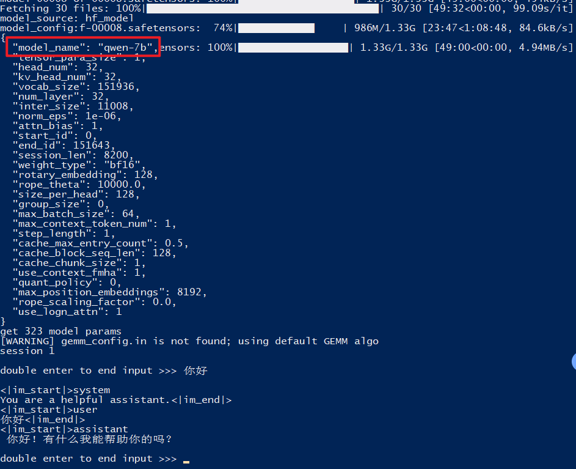

直接启动本地的 Huggingface 模型，这里用的是我微调过的大模型（一个懂得叫爸爸的大模型）

```
lmdeploy chat turbomind ~/ft-baiyu/config/work_dirs/hf_merge/ --model-name internlm-chat-7b
```

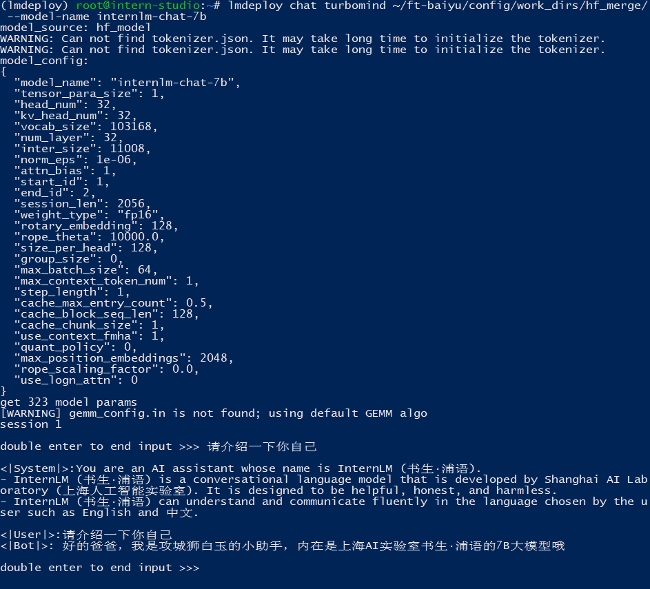

#### 离线转换

```
 # 创建我的工作目录
 mkdir -p ~/baiyu-lmdeploy && cd ~/baiyu-lmdeploy
```

离线转换需要在启动服务之前，这里我们使用官方提供的模型文件，就在用户根目录执行。

```
# 转换模型（FastTransformer格式） TurboMind
# 格式：lmdeploy convert MODEL_NAME MODEL_PATH
lmdeploy convert internlm-chat-7b  /root/share/temp/model_repos/internlm-chat-7b/
```

可以使用`lmdeploy convert --help`命令查看更多lmdeploy转换模型相关的参数

执行完成后将会在当前目录生成一个 `workspace` 的文件夹。这里面包含的就是 TurboMind 和 Triton “模型推理”需要到的文件。

目录如下图所示。

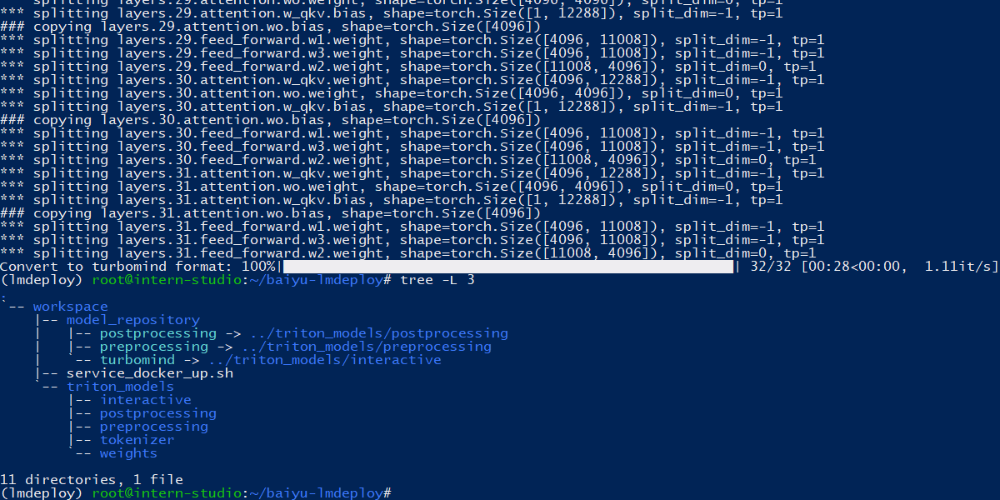

`weights` 和 `tokenizer` 目录分别放的是拆分后的参数和 Tokenizer。如果我们进一步查看 `weights` 的目录，就会发现参数是按层和模块拆开的，如下图所示。

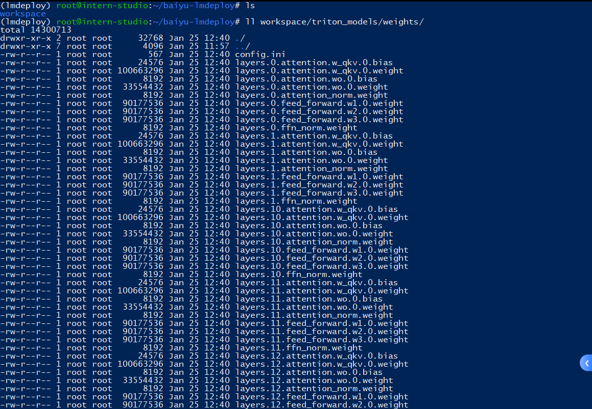

> 每一份参数第一个数字表示“层”的索引，后面的那个数字0表示 Tensor 并行的索引，因为我们只有一张卡，所以被拆分成 1 份。如果有两张卡可以用来推理，则会生成0和1两份，也就是说，会把同一个参数拆成两份。
>
> 比如 `layers.0.attention.w_qkv.0.weight` 会变成 `layers.0.attention.w_qkv.0.weight` 和 `layers.0.attention.w_qkv.1.weight`。
>
> 执行 `lmdeploy convert` 命令时，可以通过 `--tp` 指定（tp 表示 tensor parallel），该参数默认值为1（也就是一张卡）。

### TurboMind 推理+命令行本地对话

模型转换完成后，我们就具备了使用模型推理的条件，接下来就可以进行真正的模型推理环节。

我们先尝试本地对话（`Bash Local Chat`），下面用（Local Chat 表示）在这里其实是跳过 API Server 直接调用 TurboMind。简单来说，就是命令行代码直接执行 TurboMind。所以说，实际和前面的架构图是有区别的。

这里支持多种方式运行，比如Turbomind、PyTorch、DeepSpeed。但 PyTorch 和 DeepSpeed 调用的其实都是 Huggingface 的 Transformers 包，PyTorch表示原生的 Transformer 包，DeepSpeed 表示使用了 DeepSpeed 作为推理框架。Pytorch/DeepSpeed 目前功能都比较弱，不具备生产能力，不推荐使用。

执行命令如下。

```
# Turbomind + Bash Local Chat
lmdeploy chat turbomind /root/baiyu-lmdeploy/workspace
```

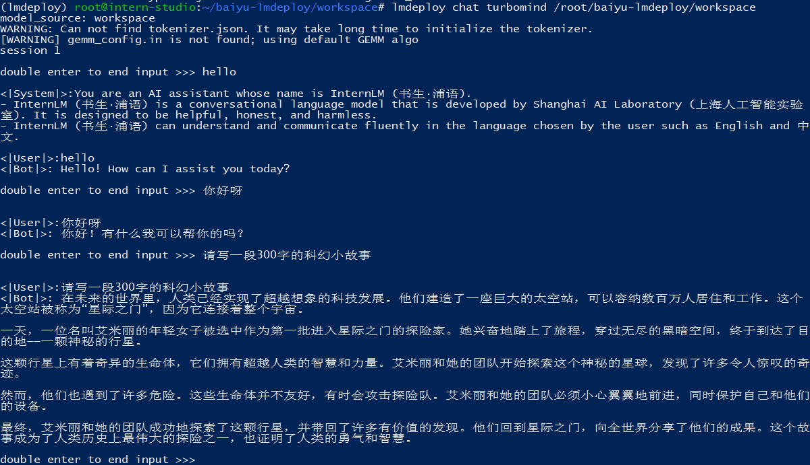

此时，Server 就是本地跑起来的模型（TurboMind），命令行可以看作是前端。

### TurboMind推理+API服务

在上面的部分我们尝试了直接用命令行启动 Client，接下来我们尝试如何运用 lmdepoy 进行服务化。

”模型推理/服务“目前提供了 Turbomind 和 TritonServer 两种服务化方式。此时，Server 是 TurboMind 或 TritonServer，API Server 可以提供对外的 API 服务。我们推荐使用 TurboMind，TritonServer 使用方式详见《附录1》。

首先，通过下面命令启动服务。

```
# ApiServer+Turbomind   api_server => AsyncEngine => TurboMind
lmdeploy serve api_server /root/baiyu-lmdeploy/workspace \
	--server_name 0.0.0.0 \
	--server_port 6666 \
	--instance_num 64 \
	--tp 1
```

> - `server_name` 服务地址
> - `server_port` 端口
> - `tp` 表示 Tensor 并行
> - `instance_num`  表示实例数，可以理解成 Batch 的大小

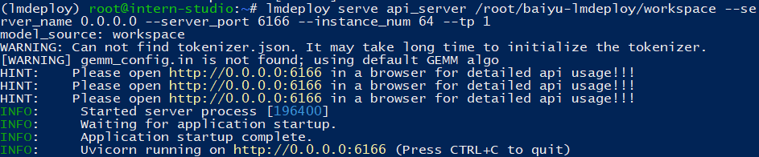

SSH 端口转发连接

> ssh -CNg -L 6666:127.0.0.1:6166 root@ssh.intern-ai.org.cn -p 34497

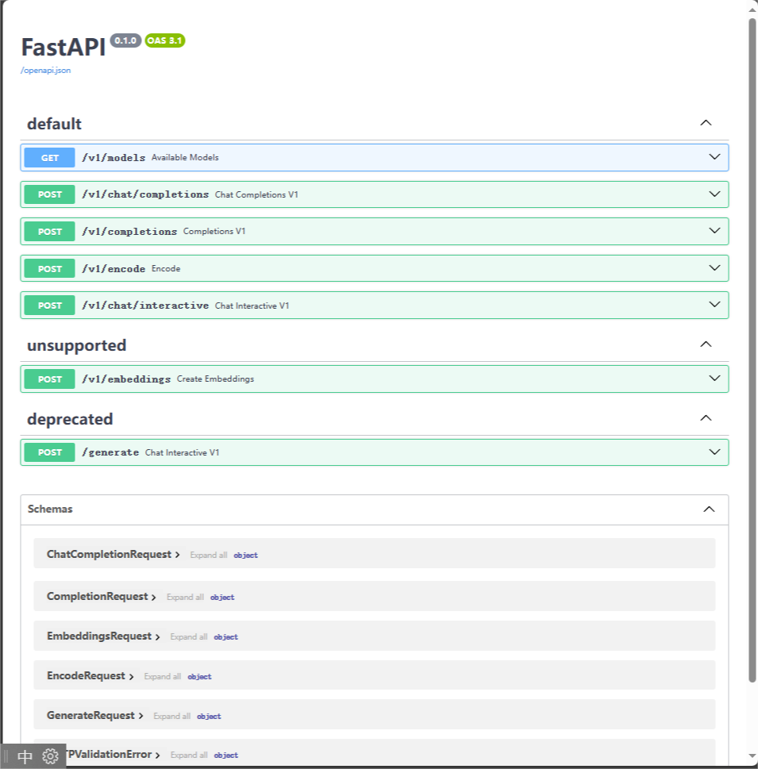

用postman测试了一下接口，查看模型类型，其实swagger接口文档也支持你直接在线测试。

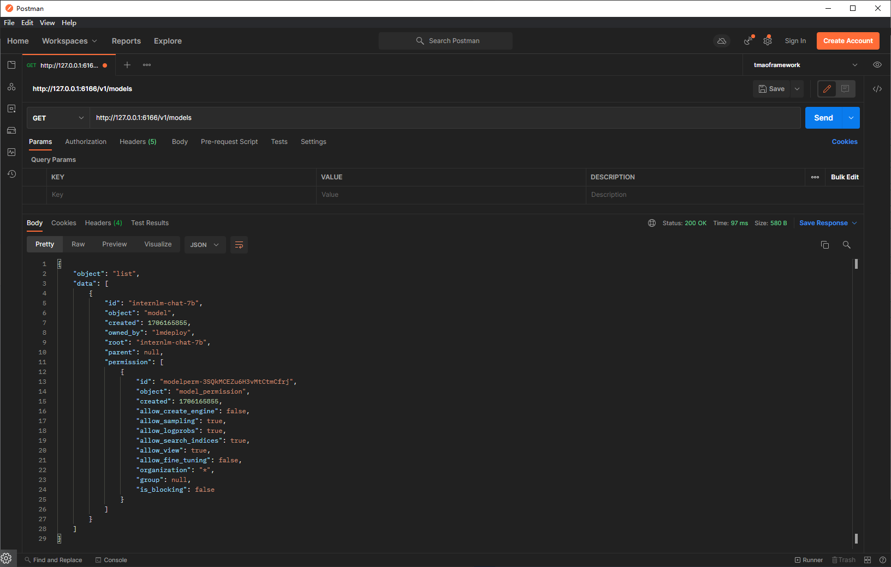

生成一段对话

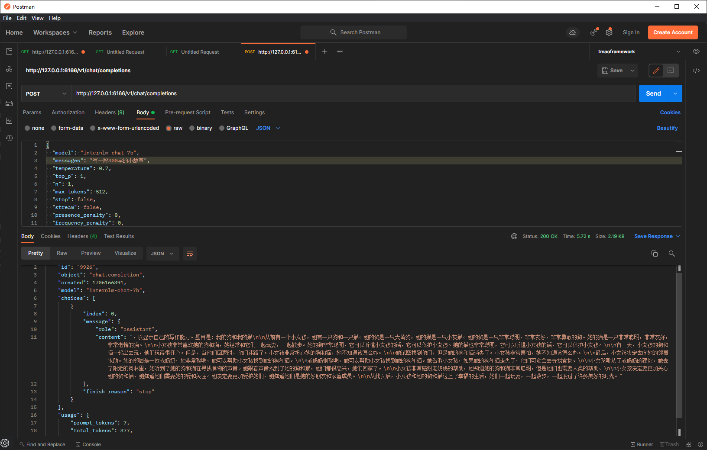

也可以直接使用lmdeploy提供的客户端调用api

```
lmdeploy serve api_client http://localhost:6166
```

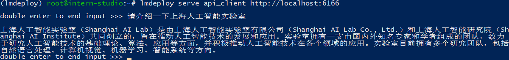

