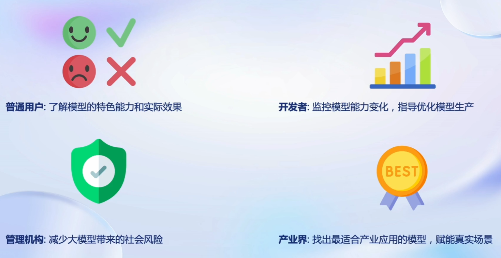
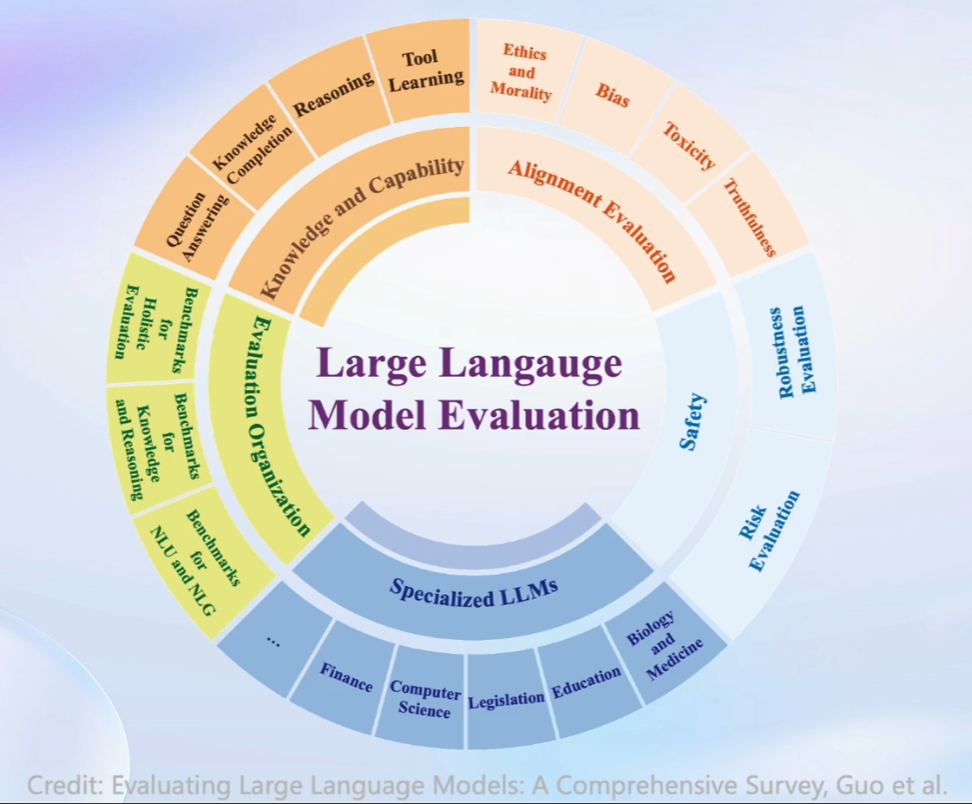
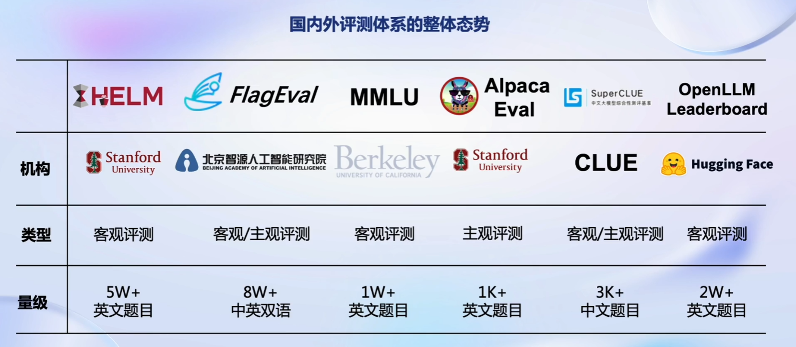
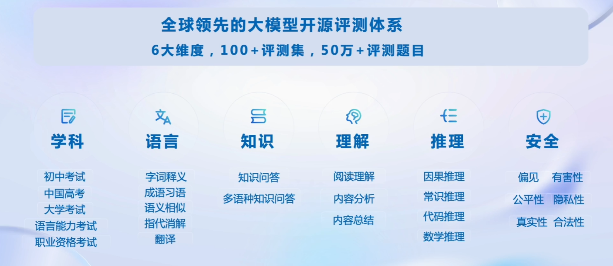
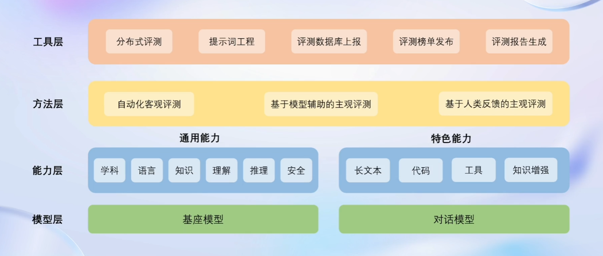
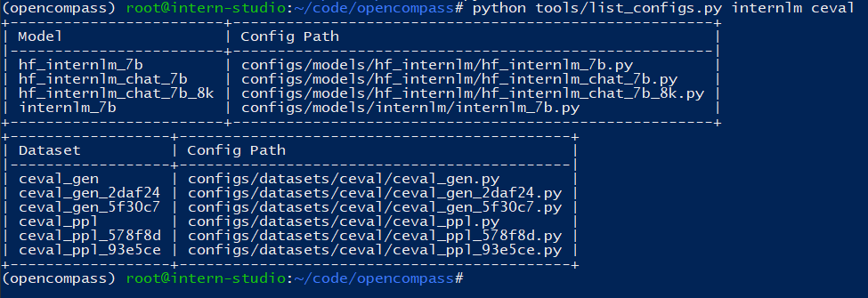
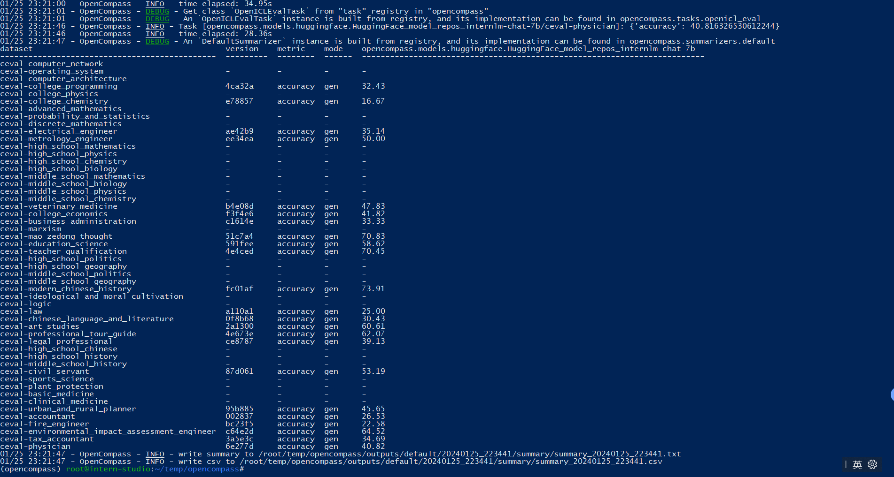

# 大模型评测

## 关于评测的三个问题

### 为什么要评测？

* 模型选型
* 模型能力提升
* 真实应用场景效果提升



### 我们需要测什么

* 知识、推理、语言
* 长文本、智能体、多轮对话
* 情感、认知、价值观



### 怎么样测试大语言模型

* 主观评测
  * 人类评价：通过人工去打分
  * 模型评价：用模型来评价模型
* 客观评测：选择题、判断题
* 提示词工程
  * 测试大模型对于提示词的敏感性

## 国内外测评体系



## OpenCompass介绍

为全面反映大模型在不同领域的能力差异，客观反映优势与问题，OpenCompass将测评方向汇总为学科、语言、知识、理解、推理、安全6大能力维度，整合集纳了超过100+个评测数据集，合计提供了超过50万+个模型评测问题



## 评测对象

OpenCompass算法库的主要评测对象为语言大模型与多模态大模型。

## 工具架构



- 模型层：大模型评测所涉及的主要模型种类，OpenCompass以基座模型和对话模型作为重点评测对象。
- 能力层：OpenCompass从本方案从通用能力和特色能力两个方面来进行评测维度设计。在模型通用能力方面，从语言、知识、理解、推理、安全等多个能力维度进行评测。在特色能力方面，从长文本、代码、工具、知识增强等维度进行评测。
- 方法层：OpenCompass采用客观评测与主观评测两种评测方式。客观评测能便捷地评估模型在具有确定答案（如选择，填空，封闭式问答等）的任务上的能力，主观评测能评估用户对模型回复的真实满意度，OpenCompass采用基于模型辅助的主观评测和基于人类反馈的主观评测两种方式。
- 工具层：OpenCompass提供丰富的功能支持自动化地开展大语言模型的高效评测。包括分布式评测技术，提示词工程，对接评测数据库，评测榜单发布，评测报告生成等诸多功能。

## 大模型测评领域的挑战

* 缺少高质量中文评测集
* 难以准确提取答案
* 能力维度不足
* 测试集混入训练集
* 测试标准各异
* 人工测试成本高昂

## 书生浦语在 [C-Eval](https://cevalbenchmark.com/index.html#home) 基准任务上的评估

在 OpenCompass 中评估一个模型通常包括以下几个阶段：**配置** -> **推理** -> **评估** -> **可视化**。

**配置**：这是整个工作流的起点。您需要配置整个评估过程，选择要评估的模型和数据集。此外，还可以选择评估策略、计算后端等，并定义显示结果的方式。

**推理与评估**：在这个阶段，OpenCompass 将会开始对模型和数据集进行并行推理和评估。**推理**阶段主要是让模型从数据集产生输出，而**评估**阶段则是衡量这些输出与标准答案的匹配程度。这两个过程会被拆分为多个同时运行的“任务”以提高效率，但请注意，如果计算资源有限，这种策略可能会使评测变得更慢。

**可视化**：评估完成后，OpenCompass 将结果整理成易读的表格，并将其保存为 CSV 和 TXT 文件。你也可以激活飞书状态上报功能，此后可以在飞书客户端中及时获得评测状态报告。

### 基础环境准备

创建conda环境

```
conda create --name opencompass --clone=/root/share/conda_envs/internlm-base

conda create --name opencompass python=3.10 pytorch torchvision pytorch-cuda -c nvidia -c pytorch -y

pip install /root/share/wheels/flash_attn-2.4.2+cu118torch2.0cxx11abiTRUE-cp310-cp310-linux_x86_64.whl
conda activate opencompass
```

拉取opencompass源码，这里我的源代码路径是`/root/code/opencompass`

```
git clone https://github.com/open-compass/opencompass
cd opencompass
pip install -e .
```

### 数据准备

```
# 解压评测数据集到 data/ 处
cp /share/temp/datasets/OpenCompassData-core-20231110.zip /root/code/opencompass
# 解压后，将会在opencompass下看到data文件夹
unzip OpenCompassData-core-20231110.zip
```

### 查看支持的数据集和模型

```
# 列出所有跟 internlm 及 ceval 相关的配置
python tools/list_configs.py internlm ceval
```



### 启动评测

确保按照上述步骤正确安装 OpenCompass 并准备好数据集后，可以通过以下命令评测 InternLM-Chat-7B 模型在 C-Eval 数据集上的性能。由于 OpenCompass 默认并行启动评估过程，我们可以在第一次运行时以 `--debug` 模式启动评估，并检查是否存在问题。在 `--debug` 模式下，任务将按顺序执行，并实时打印输出。

```
python run.py --datasets ceval_gen \
--hf-path /share/temp/model_repos/internlm-chat-7b/ \
--tokenizer-path /share/temp/model_repos/internlm-chat-7b/ \
--tokenizer-kwargs padding_side='left' truncation='left' trust_remote_code=True \
--model-kwargs trust_remote_code=True device_map='auto' \
--max-seq-len 2048 \
--max-out-len 16 \
--batch-size 4 \
--num-gpus 1 \
--debug
```

命令解析

* datasets ceval_gen 
* hf-path：HuggingFace 模型路径
* tokenizer-path：HuggingFace tokenizer 路径（如果与模型路径相同，可以省略）
* tokenizer-kwargs：构建 tokenizer 的参数
* model-kwargs：构建模型的参数
* max-seq-len：模型可以接受的最大序列长度
* max-out-len：生成的最大 token 数
* batch-size： 批量大小
* num-gpus：设置运行模型所需的 GPU 数量
* debug：启动debug模式，任务将按顺序执行，并实时打印输出

测评完成之后如下图所示：

