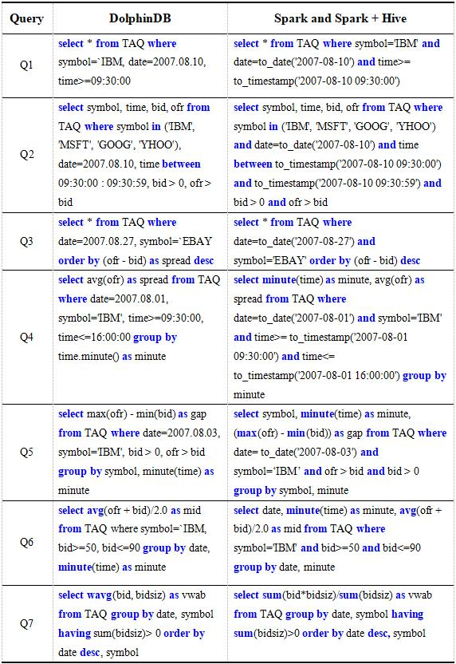

## 一、什么是prompt？

### 1.1 prompt的定义

Prompt（提示），在自然语言处理领域中是指给定输入文本后，输出一段与输入文本相关联的文本。例如：“请写一篇关于你最喜欢的动物的文章”，这就是一个典型的prompt。

### 1.2 prompt的应用场景

+ 问答系统 + 机器翻译 + 摘要生成 + 情感分析 + 命名实体识别 + 关系抽取 + 语义角色标注 + 句法分析 + 对话系统等

### 1.3 prompt的分类

根据不同的分类标准，可以将prompt分为以下几类：

| 分类 | 定义 | 示例 |

| --- | --- | --- |

  

| 基于任务的prompt | 任务导向型prompt，用于完成特定任务或解决特定问题 | “请写一篇关于你最喜欢的动物的文章” |

| 基于上下文的prompt | 上下文导向型prompt，通过上下文信息来预测下一个单词或短语 | “我是一只狗” |

  

| 基于知识的prompt | 知识导向型prompt，利用已有的知识库进行推理和推断 | “猫是哺乳动物吗？” |

| 基于风格的prompt | 风格导向型prompt，旨在模仿特定的写作风格或表达方式 | “今天天气不错，适合出去走走” |

  

| 基于主题的prompt | 主题导向型prompt，围绕某一特定主题展开讨论 | “如何提高英语口语水平？” |

| 基于结构的prompt | 结构导向型prompt，遵循一定的语法规则或句子结构 | “他是一个聪明的人” |

  

| 基于内容的prompt | 内容导向型prompt，侧重于提供具体的信息或内容 | “你喜欢什么颜色？” |

| 基于概念的prompt | 概念导向型prompt，强调对抽象概念的理解和解释 | “什么是人工智能？” |

  

| 基于语言的prompt | 语言导向型prompt，关注语言本身的特点和规律 | “这个句子中的谓语动词是什么？” |

| 基于视觉的prompt | 视觉导向型prompt，使用图像或视频作为输入，并产生相应的描述或评论 | “这是一张美丽的风景照片” |

  

| 基于音频的prompt | 音频导向型prompt，使用音频文件作为输入，并产生相应的描述或评论 | “这段音乐听起来很动听” |

| 基于位置的prompt | 位置导向型prompt，以地理位置或其他空间信息作为输入，并产生相应的描述或评论 | “这是北京的天安门广场” |

  

| 基于时间的prompt | 时间导向型prompt，以时间为输入，并产生相应的描述或评论 | “现在是上午9点” |

| 基于空间的prompt | 空间导向型prompt，以地理坐标或其他空间信息作为输入，并产生相应的描述或评论 | “这里是上海的外滩” |

  

| 基于情绪的prompt | 情绪导向型prompt，通过对输入文本的情绪分析，产生相应的描述或评论 | “这是一个悲伤的故事” |

| 基于属性的prompt | 属性导向型prompt，将输入文本映射到预先定义的属性空间，并产生相应的描述或评论 | “这本书的主题是科幻小说” |

  

| 基于关系的prompt | 关系导向型prompt，建立输入文本之间的语义关系，并产生相应的描述或评论 | “这两个词之间存在因果关系” |

| 基于常识的prompt | 常识导向型prompt，利用人类普遍认知的知识来进行推理和推断 | “今天是星期五” |

  

| 基于领域的prompt | 领域导向型prompt，针对某个特定领域进行建模和理解 | “计算机科学是一门怎样的学科？” |

| 基于模态的prompt | 模态导向型prompt，结合多种感知模态（如视觉、听觉、触觉等）来实现更丰富的交互体验 | “看到这个图片，我想到了蓝天白云和大海” |

  

| 基于多模态的prompt | 多模态导向型prompt，融合多种感知模态（如视觉、听觉、触觉等）来实现更丰富的交互体验 | “当我看到这张图片时，我的脑海中浮现出了一片绿油油的草地和一望无际的大海” |

| 基于跨模态的prompt | 跨模态导向型prompt，跨越多个感知模态（如视觉、听觉、触觉等）来实现更丰富的交互体验 | “当我看到这张图片时，我的脑海中浮现出了一片绿油油的草地和一望无际的大海；当我听到这首音乐时，我的脑海中浮现出了一片绿油油的草地和一望无际的大海” |

  

| 基于深度学习的prompt | 深度学习导向型prompt，利用深度神经网络来学习输入文本的特征表示，并产生相应的描述或评论 | “这篇文章的内容非常丰富，值得深入阅读和学习